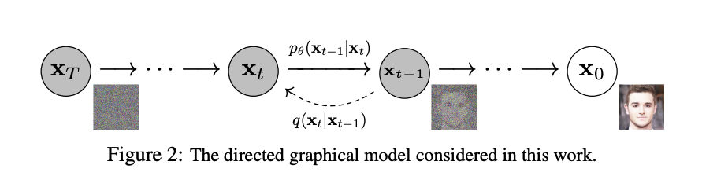
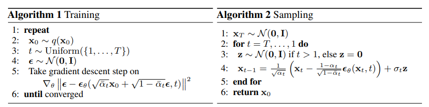
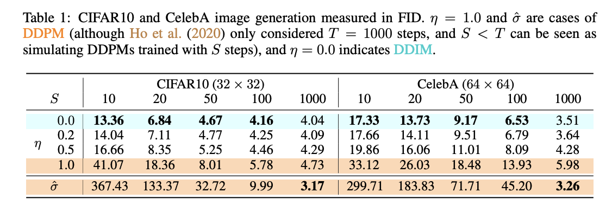

# 基本原理介绍

Diffusion模型和VAE、GAN、流模型等一样都属于生成类模型。Diffusion模型在前向阶段$q(\mathbf{x}_t|\mathbf{x}_{t-1})$逐渐对图像加噪声，直至图像被完全破坏成高斯噪声，然后在逆向阶段$p_{\theta}(\mathbf{x}_{t-1}|\mathbf{x}_t)$学习从高斯噪声逐渐还原为原始图像的过程，如图1所示，

## Forward Process （前向阶段）

作者认为前向过程中图像$\mathbf{x}_t$只和上一时刻的$\mathbf{x}_{t-1}$相关，遵循马尔可夫过程，满足如下性质：

$$ q(\mathbf{x}_{1:T}|\mathbf{x}_0)=\prod^T_{t=1}q(\mathbf{x}_t | \mathbf{x}_{t-1}) \tag{1}$$ 
$$ q(\mathbf{x}_t|\mathbf{x}_{t-1}) = \mathcal{N}(\mathbf{x}_t; \sqrt{1-\beta_t} \mathbf{x}_{t-1}, \beta_t \mathbb{I}) \tag{2}$$

其中参数 $\beta_t$ 表示第t时刻高斯分布的方差超参数，并满足 $\beta_1\lt\beta_2\lt\cdots\lt \beta_T$。公式（2）中 $\sqrt{1-\beta_t}$ 是均值系数。任意时刻可以通过 **重参数技巧** 方法采样得到$\mathbf{x}_t$。

> **Reparameterization trick 重参数技巧**
> 该方法是为了解决随机采样样本这一过程无法求导的问题，例如我们要从某个分布（如高斯分布 $z\sim\mathcal{N}(z;\mu,\sigma^2\mathbb{I})$）中随机采样一个样本，这个过程无法反传梯度。通常的做法是通过引入随机变量 $\epsilon\sim\mathcal{N}(0,\mathcal{I})$，使得 $z=\mu+\sigma\odot\epsilon$。这样一来，$z$ 仍然具有随机性，且服从高斯分布 $\mathcal{N}(\mu, \sigma^2\mathcal{I})$，同时 $\mu$与 $\sigma$可导。

> **正态分布性质** 
> 给定两个服从正态分布的独立随机变量 $X \sim \mathcal{N}(\mu_X, \sigma_X^2)$, $Y \sim \mathcal{N}(\mu_Y, \sigma^2_Y)$。这两个分布的加和为 $Z=X+Y$ 同样服从正态分布 $Z \sim \mathcal{N}(\mu_X + \mu_Y, \sigma_X^2 + \sigma_Y^2)$。

### 根据 $\mathbf{x}_0$ 推断 $\mathbf{x}_t$

根据公式（2）的采样方法，生成随机变量 $\epsilon_t \sim \mathcal{N}(0,\mathbb{I})$， 然后令 $\alpha_t = 1 - \beta_t$， 以及 $\overline{\alpha}_t = \prod^T_{i=1} \alpha_i$， 按照公式（2）中给定的系数，可以做如下推导：
$$\begin{split}
\mathbf{x}_t &= \sqrt{1-\beta_t} \mathbf{x}_{t-1} + \beta_t \epsilon_1\\
&= \sqrt{\alpha_t} \mathbf{x}_{t-1} + \sqrt{1-\alpha_t} \epsilon_1 \\
&= \sqrt{\alpha_t}(\sqrt{\alpha_{t-1}}\mathbf{x}_{t-2} + \sqrt{1-\alpha_{t-1}} \epsilon_2) + \sqrt{1-\alpha_t} \epsilon_1 \\
&= \sqrt{\alpha_t \alpha_{t-1}} \mathbf{x}_{t-2} + (\sqrt{\alpha_t (1-\alpha_{t-1})} \epsilon_2 + \sqrt{1-\alpha_t} \epsilon_1) \\
&= \sqrt{\alpha_t \alpha_{t-1}} \mathbf{x}_{t-2} + \sqrt{1-\alpha_t \alpha_{t-1}} \tilde{\epsilon_2} \\
&= \cdots \\
&= \sqrt{\overline{\alpha}_t} \mathbf{x}_0 + \sqrt{1-\overline{\alpha}_t} \tilde{\epsilon_t}
\end{split} \tag{3} $$
上式的关键在于第4行到第5行的转换。依赖的正是正态分布性质。$\epsilon_1, \epsilon_2 \sim \mathcal{N}(0, \mathbb{I})$， 因此，可以做出如下推断：
$$\sqrt{\alpha_t (1 - \alpha_{t-1})} \epsilon_2 \sim \mathcal{N}(0, \alpha_t (1-\alpha_{t-1}) \mathbb{I}) \tag{4}$$
$$\sqrt{1-\alpha_t} \epsilon_1 \sim \mathcal{N}(0, (1-\alpha_t)\mathbb{I}) \tag{5}$$
$$ \begin{split}\sqrt{\alpha_t (1 - \alpha_{t-1})} \epsilon_2 + \sqrt{1-\alpha_t} \epsilon_1 & \sim \mathcal{N}(0, \left[\alpha_t(1-\alpha_{t-1}) + (1-\alpha_t)\right])\\ &= \mathcal{N}(0, (1-\alpha_t \alpha_{t-1})\mathbb{I})\end{split}\tag{6}$$
因此公式（3）可以表示如下：
$$q(\mathbf{x}_t|\mathbf{x}_0) = \mathcal{N}(\mathbf{x}_t;\sqrt{\overline{\alpha}_t} \mathbf{x}_0, (1-\overline{\alpha}_t) \mathbb{I}) \tag{7}$$
根据前文，参数 $\beta_t \in (0,1)$ 且 $\beta_1 \lt \beta_2 \lt \cdots \lt \beta_T$，$\alpha_t = 1 - \beta_t$ 且 $\alpha_1 \gt \alpha_2 \gt \cdots \gt \alpha_T$。由于 $\overline{\alpha}_t = \prod^T_{i=1} \alpha_i$，因此，当 $T \rightarrow \infty$，$\overline{\alpha}_t \rightarrow 0$ 且 $(1-\overline{\alpha}_t) \rightarrow 1$，此时，公式（7）趋向于标准正态分布 $\mathbf{x}_T \sim \mathcal{N}(0, \mathbb{I})$。因此，公式（2）中均值前要乘以系数 $\sqrt{1-\beta_t}$。

## Reverse Process 逆向过程

前向（扩散）过程是给数据添加噪音，逆向过程就是去噪音过程。逆向过程中，我们以高斯噪声 $\mathbf{x}_T \sim \mathcal{N}(0, \mathbb{I})$ 作为输入，如果能够得到逆向过程的分布 $q(\mathbf{x}_{t-1}|\mathbf{x}_t)$， 那么我们能够得到真实的样本。根据文献 [On the theory of stochastic processes, with particular reference to applications](https://link.springer.com/chapter/10.1007/978-3-319-16859-3_42)，如果 $q(\mathbf{x}_t|\mathbf{x}_{t-1})$ 满足高斯分布且 $\beta_t$ 足够小，$q(\mathbf{x}_{t-1}|\mathbf{x}_t)$仍然是高斯分布。 由于无法直接推断 $q(\mathbf{x}_{t-1}|\mathbf{x}_t)$，因此使用深度学习模型 $p_\theta$ 去拟合 $q(\mathbf{x}_{t-1}|\mathbf{x}_t)$，模型参数为 $\theta$。

$$p_\theta(\mathbf{x}_{0:T}) = p_\theta(\mathbf{x}_1, \mathbf{x}_2, \ldots, \mathbf{x}_T) = p(\mathbf{x}_T) \prod ^T_{t=1} p_\theta (\mathbf{x}_{t-1}|\mathbf{x}_t) \tag{8}$$

$$p_\theta(\mathbf{x}_{t-1}|\mathbf{x}_t) = \mathcal{N}(\mathbf{x}_{t-1};\mu_\theta(\mathbf{x}_t, t), \Sigma_\theta(\mathbf{x}_t, t)) \tag{9}$$

### 求解条件概率 $q(\mathbf{x}_{t-1}|\mathbf{x}_t, \mathbf{x}_0)$

虽然无法直接求到 $q(\mathbf{x}_{t-1}|\mathbf{x}_t)$（注意这里是 $q$ 而不是模型的 $p_\theta$)，在知道初始分布 $\mathbf{x}_0$ 的情况下，可以通过贝叶斯公式得到 $q(\mathbf{x}_{t-1}|\mathbf{x}_t, \mathbf{x}_0)$ 为:

$$q(\mathbf{x}_{t-1}|\mathbf{x}_t, \mathbf{x}_0) = \mathcal{N}(\mathbf{x}_{t-1}; \textcolor{blue}{\tilde{\mu_t}} (\mathbf{x}_t, \mathbf{x}_0), \textcolor{red} {\tilde{\beta_t}} \mathbb{I}) \tag{10}$$

> **三变量贝叶斯公式**
> $$P(x|y,z) = \frac{P(y|x,z)P(x|z)}{P(y|z)} = \frac{P(z|x,y)P(x|y)}{P(z|y)}$$

根据上文公式（2）和（7）可知，

$$q(\mathbf{x}_t|\mathbf{x}_{t-1}) = \mathcal{N}(\mathbf{x}_t; \sqrt{1-\beta_t} \mathbf{x}_{t-1}, \beta_t \mathbb{I}) = \exp \left( -\frac{(\mathbf{x}_t - \sqrt{\alpha_t} \mathbf{x}_{t-1})^2}{2\beta_t} \right)$$

$$q(\mathbf{x}_t|\mathbf{x}_0) = \mathcal{N}(\mathbf{x}_t; \sqrt{\overline{\alpha}_t} \mathbf{x}_0, (1-\overline{\alpha}_t) \mathbb{I}) = \exp \left( -\frac{(\mathbf{x}_t - \sqrt{\overline{\alpha}_t} \mathbf{x}_0)^2}{2\beta_t} \right)$$

因此，公式（10）完整推导过程如下：
$$\begin{split}
&q(\mathbf{x}_{t-1}|\mathbf{x}_t, \mathbf{x}_0) = q(\mathbf{x}_t|\mathbf{x}_{t-1}, \mathbf{x}_0)\frac{q(\mathbf{x}_{t-1}|\mathbf{x}_0)}{q(\mathbf{x}_t|\mathbf{x}_0)}\\
& \propto \exp\left( -\frac{1}{2}\left( \frac{(\mathbf{x}_t - \sqrt{\alpha_t} \mathbf{x}_{t-1})^2}{\beta_t} + \frac{(\mathbf{x}_{t-1} - \sqrt{\overline{\alpha}_{t-1}}\mathbf{x}_0)^2}{1 - \overline{\alpha}_{t-1}} - \frac{(\mathbf{x}_t - \sqrt{\overline{\alpha}_t}\mathbf{x}_0)^2}{1 - \overline{\alpha}_t} \right)\right) \\
&= \exp \left( -\frac{1}{2} \left( \frac{\mathbf{x}_t^2 - 2\sqrt{\alpha_t} \mathbf{x}_t \textcolor{blue}{\mathbf{x}_{t-1}} + \alpha_t \textcolor{red}{\mathbf{x}_{t-1}^2}}{\beta_t} + \frac{\textcolor{red}{\mathbf{x}_{t-1}^2} - 2\sqrt{\overline{\alpha}_{t-1}} \mathbf{x}_0 \textcolor{blue}{\mathbf{x}_{t-1}}  + \overline{\alpha}_{t-1}\mathbf{x}_0^2}{1 - \overline{\alpha}_{t-1}} - \frac{(\mathbf{x}_t - \sqrt{\overline{\alpha}_t} \mathbf{x}_0)^2}{1 - \overline{\alpha}_t} \right)\right) \\
&= \exp \left( - \frac{1}{2}\left(\textcolor{red}{ (\frac{\alpha_t}{\beta_t} + \frac{1}{1 - \overline{\alpha}_{t-1}})}\mathbf{x}_{t-1}^2 - \textcolor{blue}{(\frac{2\sqrt{\alpha_t}}{\beta_t}\mathbf{x}_t + \frac{2\sqrt{\overline{\alpha}_t - 1}}{1 - \overline{\alpha}_{t-1}} \mathbf{x}_0)} \mathbf{x}_{t-1} + C(\mathbf{x}_t, \mathbf{x}_0)    \right)\right)
\end{split} \tag{11}$$

> **高斯概率密度函数**
> $$\mathcal{N}(\mu, \sigma^2) = \frac{1}{\sqrt{2 \pi \sigma}} \exp \left(-\frac{1}{2} \left( \frac{x-\mu}{\sigma}\right)^2 \right) = \frac{1}{\sqrt{2 \pi \sigma}} \exp \left(-\frac{1}{2} \left(\frac{1}{\sigma^2}x^2 - \frac{2\mu}{\sigma^2} x + \frac{\mu^2}{\sigma^2}\right)\right)$$

在上面的推导过程中，我们可以看到通过贝叶斯公式将逆向过程转换为前向过程，且最终得到的概率密度函数和高斯概率密度函数的指数部分能一一对应。结合前文 $\alpha_t + \beta_t = 1$，我们可以建立如下对应关系：

$$\begin{split}
& \frac{\alpha_t}{\beta_t} + \frac{1}{1 - \overline{\alpha}_{t-1}} = \frac{1}{\tilde{\beta}_t} \\
& \Rightarrow \tilde{\beta}_t = \frac{1}{\frac{\alpha_t}{\beta_t} + \frac{1}{1 - \overline{\alpha}_{t-1}}} = \frac{1}{\frac{\alpha_t - \overline{\alpha}_t + \beta_t}{\beta_t(1-\overline{\alpha}_{t-1})}} \\
& = \frac{\beta_t(1-\overline{\alpha}_{t-1})}{\alpha_t - \overline{\alpha}_t + \beta_t} = \frac{1 - \overline{\alpha}_{t-1}}{1 - \overline{\alpha}_t} \beta_t
\end{split}\tag{12}$$

$$\begin{split}
&\frac{2\sqrt{\alpha_t}}{\beta_t}\mathbf{x}_t + \frac{2\sqrt{\overline{\alpha}_t - 1}}{1 - \overline{\alpha}_{t-1}} \mathbf{x}_0 = \frac{2 \tilde{\mu}_t(\mathbf{x}_t, \mathbf{x}_0)}{\tilde{\beta}_t} \\
& \Rightarrow \tilde{\mu}_t(\mathbf{x}_t, \mathbf{x}_0) = \left( \frac{\sqrt{\alpha_t}}{\beta_t}\mathbf{x}_t + \frac{\sqrt{\overline{\alpha}_t - 1}}{1 - \overline{\alpha}_{t-1}} \mathbf{x}_0 \right) \tilde{\beta}_t \\
&= \left( \frac{\sqrt{\alpha_t}}{\beta_t}\mathbf{x}_t + \frac{\sqrt{\overline{\alpha}_t - 1}}{1 - \overline{\alpha}_{t-1}} \mathbf{x}_0 \right) \frac{1 - \overline{\alpha}_{t-1}}{1 - \overline{\alpha}_t} \beta_t \\
&= \frac{(1-\overline{\alpha}_{t-1})\sqrt{\alpha_t} \mathbf{x}_t + \beta_t \sqrt{\overline{\alpha}_{t-1}}\mathbf{x}_0}{\beta_t (1-\overline{\alpha}_{t-1})} \cdot \frac{(1 - \overline{\alpha}_{t-1})\beta_t }{1 - \overline{\alpha}_t} \\
&= \frac{\sqrt{\alpha_t}(1-\overline{\alpha}_{t-1})}{1-\overline{\alpha}_t} \mathbf{x}_t + \frac{\sqrt{\overline{\alpha}_{t-1}}\beta_t}{1-\overline{\alpha}_t} \mathbf{x}_0
\end{split}\tag{13}$$

### 求解均值 $\mu_\theta(\mathbf{x}_t, \mathbf{x}_0)$ 和方差 $\Sigma_\theta(\mathbf{x}_t, \mathbf{x}_0)$

通过公式（10）和（11），我们可以得到 $q(\mathbf{x}_{t-1}|\mathbf{x}_t, \mathbf{x}_0)$ 的分布。而且，根据公式（3）$\mathbf{x}_t = \sqrt{\overline{\alpha}_t}\mathbf{x}_0 + \sqrt{1-\overline{\alpha_t}}\tilde{\epsilon}_t$，可以得到：
$$\mathbf{x}_0 = \frac{1}{\sqrt{\overline{\alpha}_t}}(\mathbf{x}_t - \sqrt{1-\overline{\alpha}_t} \tilde{\epsilon}_t) \tag{14}$$

将公式（14）代入公式（13），可以得到如下结果：
$$\begin{split}
\tilde{\mu}_t(\mathbf{x}_t, \mathbf{x}_0) &= \frac{\sqrt{\alpha_t}(1-\overline{\alpha}_{t-1})}{1-\overline{\alpha}_t} \mathbf{x}_t + \frac{\sqrt{\overline{\alpha}_{t-1}}\beta_t}{1-\overline{\alpha}_t} \mathbf{x}_0 \\
&= \frac{\sqrt{\alpha_t}(1-\overline{\alpha}_{t-1})}{1-\overline{\alpha}_t} \mathbf{x}_t + \frac{\sqrt{\overline{\alpha}_{t-1}}\beta_t}{1-\overline{\alpha}_t} \frac{1}{\sqrt{\overline{\alpha}_t}}(\mathbf{x}_t - \sqrt{1-\overline{\alpha}_t} \tilde{\epsilon}_t) \\
&= \frac{\alpha_t(1-\overline{\alpha}_{t-1})\mathbf{x}_t}{\sqrt{\alpha_t}(1-\overline{\alpha}_t)} + \frac{\beta_t}{\sqrt{\alpha_t}(1-\overline{\alpha}_t)}(\mathbf{x}_t - \sqrt{1-\overline{\alpha}_t}\epsilon_t)\\
&= \frac{\alpha_t \mathbf{x}_t - \overline{\alpha}_t\mathbf{x}_t + (1-\alpha_t)\mathbf{x}_t - (1-\alpha_t)\sqrt{1-\overline{\alpha}_t}\epsilon_t}{\sqrt{\alpha_t}(1-\overline{\alpha}_t)} \\
&= \frac{(1-\overline{\alpha}_t)\mathbf{x}_t - (1-\alpha_t)\sqrt{1-\overline{\alpha}_t}\epsilon_t}{\sqrt{\alpha_t}(1-\overline{\alpha}_t)}\\
&= \frac{\mathbf{x}_t}{\sqrt{\alpha_t}} - \frac{(1-\alpha_t)\epsilon_t}{\sqrt{\alpha_t}\sqrt{1-\overline{\alpha}_t}}\\
&= \frac{1}{\sqrt{\alpha_t}}\left(\mathbf{x}_t - \frac{1-\alpha_t}{\sqrt{1-\overline{\alpha}_t}} \epsilon_t \right)
\end{split}\tag{15}$$

之前说到，我们使用深度学习模型 $p_\theta$ 去拟合逆向过程的分布 $q(\mathbf{x}_{t-1}|\mathbf{x}_t)$， 根据公式（9）可知，$p_\theta(\mathbf{x}_{t-1}|\mathbf{x}_t) = \mathcal{N}(\mathbf{x}_{t-1};\mu_\theta(\mathbf{x}_t, t), \Sigma_\theta(\mathbf{x}_t, t))$，我们希望训练模型 $\mu_\theta(\mathbf{x}_t, t)$ 以预估 $\tilde{\mu}_t = \frac{1}{\sqrt{\alpha_t}}\left(\mathbf{x}_t - \frac{1-\alpha_t}{\sqrt{1-\overline{\alpha}_t}} \epsilon_t \right)$。由于 $\mathbf{x}_t$ 在训练阶段的逆向过程中是输入的图片数据，因此是已知的，我们可以转而让模型去预估噪声 $\epsilon_t$， 即令：

$$\mu_\theta (\mathbf{x}_t, t) = \frac{1}{\sqrt{\alpha_t}}\left(\mathbf{x}_t - \frac{1-\alpha_t}{\sqrt{1-\overline{\alpha}_t}} \epsilon_\theta(\mathbf{x}_t, t) \right) \tag{16}$$

因此，

$$ \mathbf{x}_{t-1} = \mathcal{N}(\mathbf{x}_{t-1}; \frac{1}{\sqrt{\alpha_t}}\left(\mathbf{x}_t - \frac{1-\alpha_t}{\sqrt{1-\overline{\alpha}_t}} \epsilon_\theta(\mathbf{x}_t, t) \right), \Sigma_\theta(\mathbf{x}_t, t) ) \tag{17}$$

方差 $\Sigma_\theta(\mathbf{x}_t, t)$ 可以有多种选择，DDPM使用的是 $\Sigma_\theta(\mathbf{x}_t, t) = \tilde{\beta}_t$ 且认为 $\tilde{\beta}_t = \beta_t$ 和 $\tilde{\beta}_t = \frac{1 - \overline{\alpha}_{t-1}}{1 - \overline{\alpha}_t} \cdot \beta_t$ 的结果近似，而在[GLIDE](https://arxiv.org/abs/2112.10741)中，则是根据网络预测的结果计算方差。

### DDPM 推断过程

因此，DDPM每一步推断可以总结如下：

+ 每个时间步骤通过 $\mathbf{x}_t$ 和步骤 $t$ 来预测高斯噪声 $\epsilon_\theta(\mathbf{x}_t, t)$，然后根据公式（16）得到均值 $\mu_\theta(\mathbf{x}_t, t)$
+ 得到方差 $\Sigma_\theta(\mathbf{x}_t, t)$， DDPM使用的是 $\Sigma_\theta(\mathbf{x}_t, t) = \tilde{\beta}_t$ 且认为 $\tilde{\beta}_t = \beta_t$ 和 $\tilde{\beta}_t = \frac{1 - \overline{\alpha}_{t-1}}{1 - \overline{\alpha}_t} \cdot \beta_t$ 的结果近似，
+ 根据公式（9）得到 $q(\mathbf{x}_{t-1}|\mathbf{x}_t)$，利用重参数得到 $\mathbf{x}_{t-1}$

## Diffusion 模型训练

逆向阶段是让模型去预估噪声 $\epsilon_\theta(\mathbf{x}_t, t)$，从而产生较好的 $\mu_\theta(\mathbf{x}_t, t)$ 和 $\Sigma_\theta(\mathbf{x}_t, t)$， 以求得概率 $q(\mathbf{x}_{t-1}|\mathbf{x}_t)$。 作者的目标是在真实数据分布下，最大化模型预测分布的对数似然函数，即优化 $\mathcal{x}_0 \sim q(\mathcal{x}_0)$ 下的 $p_\theta(\mathcal{x}_0)$ 的交叉熵。

$$\mathcal{L} =\mathbb{E}_{q(\mathbf{x}_0)} \left[ -\log p_\theta(\mathcal{x}_0) \right] \tag{18} $$

和变分自动编码器类似，使用变分下限（Variantional Lower Bound, VLB）也称ELBO（Evidence Lower Bound），来优化 $-\log p_\theta(\mathbf{x}_0)$：

$$\begin{split}
-\log p_\theta(\mathbf{x}_0) &\le -\log p_\theta(\mathbf{x}_0) + KL(q(\mathbf{x}_{1:T}|\mathbf{x}_0)||p_\theta(\mathbf{x}_{1:T}|\mathbf{x}_0)) \\
&= -\log p_\theta(\mathbf{x}_0) + \mathbb{E}_{q(\mathbf{x}_{1:T}|\mathbf{x}_0)} \left[\log \frac{q(\mathbf{x}_{1:T}|\mathbf{x}_0)}{p_\theta(\mathbf{x}_{1:T}|\mathbf{x}_0)}\right] \\
&= -\log p_\theta(\mathbf{x}_0) + \mathbb{E}_{q(\mathbf{x}_{1:T}|\mathbf{x}_0)} \left[\log \frac{q(\mathbf{x}_{1:T}|\mathbf{x}_0)}{p_\theta(\mathbf{x}_{0:T})/p_\theta(\mathbf{x}_0)}\right] \\
&= -\log p_\theta(\mathbf{x}_0) + \mathbb{E}_{q(\mathbf{x}_{1:T}|\mathbf{x}_0)} \left[\log \frac{q(\mathbf{x}_{1:T}|\mathbf{x}_0)}{p_\theta(\mathbf{x}_{0:T})} + \underbrace{\log p_\theta(\mathbf{x}_0)}_{与q无关}\right] \\
&= \mathbb{E}_{q(\mathbf{x}_{1:T}|\mathbf{x}_0)} \left[\log \frac{q(\mathbf{x}_{1:T}|\mathbf{x}_0)}{p_\theta(\mathbf{x}_{0:T})} \right] \\
\end{split}\tag{19}$$

> **KL散度**
> $$KL(P||Q) = \sum_i P(x_i) \log \frac{P(x_i)}{Q(x_i)}$$
>
> **Fubini定理**
> 
> 如果 $\int_{A\times B} |f(x,y)| d(x,y) < \infty$, 则下式成立
> $$\int_A \left(\int_B f(x,y) dy\right)dx = \int_B \left(\int_A f(x,y) dx\right)dy = \int_{A\times B} f(x,y) d(x,y)$$

### Fubini定理推断$\mathcal{L}_{VLB}$
根据公式（18），对公式（19）左右两边取期望 $\mathbb{E}_{q(\mathbf{x}_0)}$，利用重积分中的Fubini定理：
$$\begin{split}
\mathcal{L}_{VLB} &= \mathbb{E}_{q(\mathbf{x}_0)}\left( \mathbb{E}_{q(\mathbf{x}_{1:T}|\mathbf{x}_0)} \left[\log \frac{q(\mathbf{x}_{1:T}|\mathbf{x}_0)}{p_\theta(\mathbf{x}_{0:T})} \right]  \right) = \mathbb{E}_{q(\mathbf{x_{0:T}})} \left[ \log \frac{q(\mathbf{x}_{1:T}|\mathbf{x}_0)}{p_\theta(\mathbf{x}_{0:T})}  \right] \\
& \ge \mathbb{E}_{q(\mathbf{x}_0)} \left[ -\log p_\theta(\mathcal{x}_0) \right]
\end{split}\tag{20}$$

最小化 $\mathcal{L}_{VLB}$ 即可最小化我们的目标损失函数，即公式（18）。

### Jensen不等式推断$\mathcal{L}_{VLB}$

> **Jensen不等式概率论版本**
> 
> 对于随机变量$X$，$\varphi$ 是任意凸函数，则下式成立
> $$\varphi(E(X)) \le E(\varphi(X))$$

$$\begin{split}
\mathcal{L} &= \mathbb{E}_{q(\mathbf{x}_0)} \left[ -\log p_\theta(\mathcal{x}_0) \right] \\
&= - \mathbb{E}_{q(\mathbf{x}_0)} \log \left( p_\theta(\mathbf{x}_0) \cdot \int p_\theta(\mathbf{x}_{1:T}) d\mathbf{x}_{1:T} \right) \\
&= - \mathbb{E}_{q(\mathbf{x}_0)}\log\left( \int p_\theta(\mathbf{x}_{0:T})d\mathbf{x}_{1:T} \right)\\
&= - \mathbb{E}_{q(\mathbf{x}_0)}\log\left( \int q(\mathbf{x}_{1:T}|\mathbf{x}_0) \frac{p_\theta(\mathbf{x}_{0:T})}{q(\mathbf{x}_{1:T}|\mathbf{x}_0)} d\mathbf{x}_{1:T} \right)\\
&= - \mathbb{E}_{q(\mathbf{x}_0)}\log\left( \mathbb{E}_{q(\mathbf{x}_{1:T}|\mathbf{x}_0)} \frac{p_\theta(\mathbf{x}_{0:T})}{q(\mathbf{x}_{1:T}|\mathbf{x}_0)} \right)\\
&= \mathbb{E}_{q(\mathbf{x}_0)}\log\left( \mathbb{E}_{q(\mathbf{x}_{1:T}|\mathbf{x}_0)} \frac{q(\mathbf{x}_{1:T}|\mathbf{x}_0)}{p_\theta(\mathbf{x}_{0:T})} \right)\\
&\le \mathbb{E}_{q(\mathbf{x}_{0:T})} \log \frac{q(\mathbf{x}_{1:T}|\mathbf{x}_0)}{p_\theta(\mathbf{x}_{0:T})} = \mathcal{L}_{VLB}
\end{split} \tag{21}$$

可以看到，通过Fubini定理和Jensen不等式都可以得到相同的结果。这里需要解释下公式（21）中几个步骤。

+ 第2行到第3行：因为 $p_\theta(\mathbf{x}_0)$ 和 $\mathbf{x}_{1:T}$ 无关，因此可以将 $p_\theta(\mathbf{x}_0)$ 看作常数项与 $p_\theta(\mathbf{x}_{1:T})$ 相乘。根据联合概率密度函数定义，我们可以看出 $p_\theta(\mathbf{x}_{0:T}) = p_\theta(\mathbf{x}_0) p_\theta(\mathbf{x}_{1:T})$
+ 第6行到第7行：将 $\log$ 函数看作 $\varphi$，根据Jensen不等式可知不等号成立。且根据 $p_\theta(\mathbf{x}_{0:T}) = p_\theta(\mathbf{x}_0) p_\theta(\mathbf{x}_{1:T})$，我们可以看出，对 $q(\mathbf{x}_0)$ 和 $q(\mathbf{x}_{1:T}|\mathbf{x}_0)$ 连续积分可以得到 $q(\mathbf{x}_{0:T})$ 

### 进一步拆解 $\mathcal{L}_{VLB} $

进一步对 $\mathcal{L}_{VLB}$ 推导，可以得到熵与多个KL散度的累加，具体推导如下：

$$\begin{split}
\mathcal{L}_{VLB} &= \mathbb{E}_{q(\mathbf{x}_{0:T})} \left[ \log \frac{q(\mathcal{x}_{1:T}|\mathcal{x}_0)}{p_\theta(\mathcal{x}_{0:T})} \right]\\
&= \mathbb{E}_{q(\mathbf{x}_{0:T})} \left[ \log \frac{\prod^T_{t=1} q(\mathbf{x}_t|\mathbf{x}_{t-1})}{p_\theta(\mathbf{x}_T)\prod^T_{t=1}p_\theta(\mathbf{x}_{t-1}|\mathbf{x}_t)} \right]\\
&= \mathbb{E}_{q(\mathbf{x}_{0:T})} \left[ - \log p_\theta(\mathbf{x}_T) + \sum^T_{t=1} \log \frac{q(\mathbf{x}_t|\mathbf{x}_{t-1})}{p_\theta(\mathbf{x}_{t-1}|\mathbf{x}_t)} \right]\\
&= \mathbb{E}_{q(\mathbf{x}_{0:T})} \left[ - \log p_\theta(\mathbf{x}_T) + \sum^T_{t=2} \log \frac{q(\mathbf{x}_t|\mathbf{x}_{t-1})}{p_\theta(\mathbf{x}_{t-1}|\mathbf{x}_t)} + \log \frac{q(\mathbf{x}_1|\mathbf{x}_0)}{p_\theta(\mathbf{x}_0|\mathbf{x}_1)} \right]\\
&= \mathbb{E}_{q(\mathbf{x}_{0:T})} \left[ - \log p_\theta(\mathbf{x}_T) + \sum^T_{t=2} \log \left( \frac{q(\mathbf{x}_t|\mathbf{x}_t, \mathbf{x}_0)}{p_\theta(\mathbf{x}_{t-1}|\mathbf{x}_t)} \cdot \frac{q(\mathbf{x}_t|\mathbf{x}_0)}{q(\mathbf{x}_{t-1}|\mathbf{x}_0)} \right) + \log \frac{q(\mathbf{x}_1|\mathbf{x}_0)}{p_\theta(\mathbf{x}_0|\mathbf{x}_1)} \right]\\
&= \mathbb{E}_{q(\mathbf{x}_{0:T})} \left[ - \log p_\theta(\mathbf{x}_T) + \sum^T_{t=2} \log \frac{q(\mathbf{x}_t|\mathbf{x}_t, \mathbf{x}_0)}{p_\theta(\mathbf{x}_{t-1}|\mathbf{x}_t)} + \sum^T_{t=2} \log \frac{q(\mathbf{x}_t|\mathbf{x}_0)}{q(\mathbf{x}_{t-1}|\mathbf{x}_0)} + \log \frac{q(\mathbf{x}_1|\mathbf{x}_0)}{p_\theta(\mathbf{x}_0|\mathbf{x}_1)} \right]\\
&= \mathbb{E}_{q(\mathbf{x}_{0:T})} \left[ - \log p_\theta(\mathbf{x}_T) + \sum^T_{t=2} \log \frac{q(\mathbf{x}_t|\mathbf{x}_t, \mathbf{x}_0)}{p_\theta(\mathbf{x}_{t-1}|\mathbf{x}_t)} + \log \frac{q(\mathbf{x}_T|\mathbf{x}_0)}{q(\mathbf{x}_{1}|\mathbf{x}_0)} + \log \frac{q(\mathbf{x}_1|\mathbf{x}_0)}{p_\theta(\mathbf{x}_0|\mathbf{x}_1)} \right]\\
&= \mathbb{E}_{q(\mathbf{x}_{0:T})} \left[ - \log p_\theta(\mathbf{x}_T) + \sum^T_{t=2} \log \frac{q(\mathbf{x}_t|\mathbf{x}_t, \mathbf{x}_0)}{p_\theta(\mathbf{x}_{t-1}|\mathbf{x}_t)}  + \log q(\mathbf{x}_1|\mathbf{x}_0) - \log p_\theta(\mathbf{x}_0|\mathbf{x}_1) \right] \\
&= \mathbb{E}_{q(\mathbf{x}_{0:T})} \left[ \log \frac{q(\mathbf{x}_T|\mathbf{x}_0)}{p_\theta(\mathbf{x}_T)} + \sum^T_{t=2} \log \frac{q(\mathbf{x}_t|\mathbf{x}_t, \mathbf{x}_0)}{p_\theta(\mathbf{x}_{t-1}|\mathbf{x}_t)} - \log p_\theta(\mathbf{x}_0|\mathbf{x}_1) \right]\\
&= \mathbb{E}_{q(\mathbf{x}_{0:T})} \left[ \underbrace{KL(q(\mathbf{x}_T|\mathbf{x}_0)||p_\theta(\mathbf{x}_T))}_{L_T} + \sum^T_{t=2} \underbrace{KL(q(\mathbf{x}_{t-1}|\mathbf{x}_t, \mathbf{x}_0)||p_\theta(\mathbf{x}_{t-1}|\mathbf{x}_t))}_{L_{t-1}} - \underbrace{\log p_\theta(\mathbf{x}_0|\mathbf{x}_1)}_{L_0} \right]
\end{split}\tag{22}$$

公式（22）的解释：
+ 第1行到第2行：分子是根据公式（1）得来。分母是根据公式（8）得来
+ 第4行到第5行：我们可以看到，第四行中 $\log$ 符号后分式中分母保持不变，只是分子 $q(\mathbf{x}_t|\mathbf{x}_{t-1})$ 通过贝叶斯公式转换：
$$q(\mathbf{x}_t|\mathbf{x}_{t-1}) = \frac{q(\mathbf{x}_t, \mathbf{x}_{t-1}|\mathbf{x}_0)}{q(\mathbf{x}_{t-1}|\mathbf{x}_0)} = \frac{q(\mathbf{x}_{t-1}|\mathbf{x}_{t},\mathbf{x}_0) \cdot p(\mathbf{x}_{t}|\mathbf{x}_0)}{q(\mathbf{x}_{t-1}|\mathbf{x}_0)} $$

公式（22）可以重新写为以下公式：
$$\mathcal{L}_{VLB} = L_T + L_{T-1} + \cdots + L_0 \tag{23-1}$$
$$L_T = KL(q(\mathbf{x}_T|\mathbf{x}_0)||p_\theta(\mathbf{x}_T)) \tag{23-2}$$
$$L_t = KL(q(\mathbf{x}_{t-1}|\mathbf{x}_t, \mathbf{x}_0)||p_\theta(\mathbf{x}_{t-1}|\mathbf{x}_t)); \quad 1 \le t \le T-1 \tag{23-3}$$
$$L_0 = - \log p_\theta(\mathbf{x}_0|\mathbf{x}_1) \tag{23-4}$$

### DDPM的LOSS

由于前向过程 $q$ 没有可学习的参数，而且 $\mathcal{x}_T$ 是纯高斯噪声，因此公式（23-2）中的 $L_T$ 可以当作常量忽略。最后一项 $L_0$ 作者使用离散分段累计函数来计算，可以避免计算协方差等过程，但该项对最终结果影响不大。
$L_t$ 可以看作是拉近两个变量的高斯分布，即公式（10）$q(\mathbf{x}_{t-1}|\mathbf{x}_t, \mathbf{x}_0) = \mathcal{N}(\mathbf{x}_{t-1}; \textcolor{blue}{\tilde{\mu_t}} (\mathbf{x}_t, \mathbf{x}_0), \textcolor{red} {\tilde{\beta_t}} \mathbb{I})$ 和公式（9）$p_\theta(\mathbf{x}_{t-1}|\mathbf{x}_t) = \mathcal{N}(\mathbf{x}_{t-1};\mu_\theta(\mathbf{x}_t, t), \Sigma_\theta(\mathbf{x}_t, t))$，根据[多元高斯分布的KL散度求解](https://en.wikipedia.org/wiki/Kullback%E2%80%93Leibler_divergence#Multivariate_normal_distributions)，可以得到下式：
$$L_t = \mathbb{E}_{q(\mathbf{x}_{0:T})}\left[\frac{1}{2||\Sigma_\theta(\mathbf{x}_t, \mathbf{x}_0)||_2^2}||\tilde{\mu}(\mathbf{x}_t, \mathbf{x}_0) - \mu_\theta(\mathbf{x}_t, t)||^2 \right]+C_t \tag{24}$$

> **多元高斯分布KL散度解释**
> 
> $$KL(p||q) = \frac{(\mu_1 - \mu_2)^2}{2 \sigma_2^2} + \frac{\sigma_1^2}{2\sigma_2^2} + \log \frac{\sigma_2}{\sigma_p} - \frac{1}{2} $$
> 由于DDPM中只有均值是与参数 $\theta$ 相关，因此，这里后三项都是与参数 $\theta$ 无关的常数。

其中公式（24）中参数 $C$ 是与模型参数 $\theta$ 无关的常量。将公式（15）和公式（16）的结果代入公式（24）可以得到：
$$\begin{split}
L_t &= \mathbb{E}_{\mathbf{x}_0, \epsilon}\left[\frac{1}{2||\Sigma_\theta(\mathbf{x}_t, \mathbf{x}_0)||_2^2}||\tilde{\mu}(\mathbf{x}_t, \mathbf{x}_0) - \mu_\theta(\mathbf{x}_t, t)||^2 \right]\\ 
&= \mathbb{E}_{\mathbf{x}_0, \epsilon}\left[\frac{1}{2||\Sigma_\theta||_2^2}\left|\left|\frac{1}{\sqrt{\alpha_t}}\left(\mathbf{x}_t - \frac{1-\alpha_t}{\sqrt{1-\overline{\alpha}_t}} \epsilon_t \right) - \frac{1}{\sqrt{\alpha_t}}\left(\mathbf{x}_t - \frac{1-\alpha_t}{\sqrt{1-\overline{\alpha}_t}} \epsilon_\theta(\mathbf{x}_t, t) \right)\right|\right|^2 \right]\\
&= \mathbb{E}_{\mathbf{x}_0, \epsilon} \left[ \frac{1}{2||\Sigma_\theta||_2^2} \left|\left| \frac{1}{\sqrt{\overline{\alpha}_t}} \frac{1-\alpha_t}{\sqrt{1-\overline{\alpha}_t}} (\epsilon_t - \epsilon_\theta(\mathbf{x}_t, t)) \right|\right|^2\right] \\
&= \mathbb{E}_{\mathbf{x}_0, \epsilon} \left[ \frac{(1-\alpha_t)^2}{2 \alpha_t (1-\overline{\alpha}_t) ||\Sigma_\theta||^2_2} ||\epsilon_t - \epsilon_\theta(\mathbf{x}_t, t)||^2 \right] \\
&= \mathbb{E}_{\mathbf{x}_0, \epsilon} \left[ \frac{(1-\alpha_t)^2}{2 \alpha_t (1-\overline{\alpha}_t) ||\Sigma_\theta||^2_2} ||\epsilon_t - \epsilon_\theta(\sqrt{\overline{\alpha}_t} \mathbf{x}_0 + \sqrt{1-\overline{\alpha}_t} \tilde{\epsilon_t}, t)||^2 \right] \\
\end{split}\tag{25}$$

公式（25）中最后一行是根据公式（3）将 $\mathbf{x}_t$ 替换为 $\mathbf{x}_0$。因此DDPM的Loss狠心是学习高斯噪声 $\epsilon_t$ 和 $\epsilon_\theta$ 之间的MSE。

## DDPM最终算法
DDPM最终算法流程如下，其中Training表示训练阶段，Sampling表示逆向阶段。根据代码理解，Train完成之后，通过Sampling生成图像。

**训练阶段的步骤：**

+ 从数据集中采样 $\mathbf{x}_0$

+ 随机选取时间步骤$t$

+ 生成高斯噪声 $\epsilon_t \in \mathcal{N}(0, \mathbb{I})$

+ 预估 $\epsilon_\theta(\sqrt{\overline{\alpha}_t} \mathbf{x}_0 + \sqrt{1-\overline{\alpha}_t} \tilde{\epsilon_t}, t)$

+ 计算MSE Loss: $||\epsilon_t - \epsilon_\theta(\sqrt{\overline{\alpha}_t} \mathbf{x}_0 + \sqrt{1-\overline{\alpha}_t} \tilde{\epsilon_t}, t)||^2$，并利用反向传播算法训练模型

**逆向阶段采用如下步骤进行采样：**

+ 从高斯分布中采样 $\mathcal{x}_T$

+ 按照 $T,T-1,\cdots,1$的顺序进行迭代

    - 如果 $t$ = 1，令 $z=0$；如果 $t>1$，则从高斯分布中采样 $z\sim\mathcal{N}(0, \mathbb{I})$

    - 利用公式（16）学习出均值 $\mu_\theta(\mathbf{x}_t, t)$，并利用公式（12）计算方差 $\sigma_t$

    - 通过重参数技巧采样 $\mathbf{x}_{t-1} = \mu_\theta(\mathbf{x}_t, t) + \sigma_t z$ 
    
+ 通过以上步骤恢复出 $\mathbf{x}_0$

# 代码解读

Coming soon

# DDIM：加速Diffusion采样和方差的选择

DDPM的高质量生成依赖较大的 $T$, 这就导致Diffusion的前向过程非常缓慢，因此有作者提出一种牺牲多样性来换取更快推断的手段，提出了 [Denoising diffusion implicit model (DDIM)](https://arxiv.org/abs/2010.02502)。 

根据公式（3）及高斯分布可加性，可以得到 $\mathbf{x}_{t-1}$ 为：
$$\begin{split}
\mathbf{x}_{t-1} &= \sqrt{\overline{\alpha}_{t-1}} \mathbf{x}_0 + \sqrt{1 - \overline{\alpha}_{t-1}} \tilde{\epsilon}_{t-1} \\
&= \sqrt{\overline{\alpha}_{t-1}} \mathbf{x}_0 + \sqrt{1-\overline{\alpha}_{t-1}-\sigma^2_t}\tilde{\epsilon}_t + \sigma_t \epsilon_t \\
&= \sqrt{\overline{\alpha}_{t-1}} 
\mathbf{x}_0 + \sqrt{1 - \overline{\alpha}_{t-1} - \sigma^2_t} \left( \frac{\mathbf{x}_t - \sqrt{\overline{\alpha}_t}\mathbf{x}_0}{\sqrt{1-\overline{\alpha}_t}} \right) + \sigma_t \epsilon_t
\end{split}\tag{26}$$

根据上文，我们可以得知 $\epsilon_t \sim \mathcal{N}(0,1)$ 是服从标准正态分布的噪声, $\tilde{\epsilon}_t \sim \mathcal{N}(0,1)$ 是根据正态分布可加性变换过的且服从标准正态分布的噪声。 公式（26）第二行是根据高斯分布可加性推导而来， 假定 $P_A = \sqrt{1-\overline{\alpha}_{t-1}} \tilde{\epsilon}_{t-1} \sim \mathcal{N}\left(0, (1-\overline{\alpha}_{t-1}) \mathbb{I}\right) $，$P_B = \mathcal{N}(0, \sigma_t^2) $，我们可以得到如下推断：
$$\begin{split}
P_A &= P_A - P_B + P_B\\
&= \sqrt{\overline{\alpha}_{t-1}} \mathbf{x}_0 + \sqrt{1-\overline{\alpha}_{t-1}-\sigma^2_t}\tilde{\epsilon}_t + \sigma_t \epsilon_t \\
\end{split}\tag{27}$$
公式（26）第二行到第三行也是根据公式（3）变换而来：
$$\begin{split}
& \mathbf{x}_{t} = \sqrt{\overline{\alpha}_{t}} \mathbf{x}_0 + \sqrt{1 - \overline{\alpha}_{t}} \tilde{\epsilon}_{t} \\ 
& \Rightarrow \tilde{\epsilon}_t = \frac{\mathbf{x}_t - \sqrt{\overline{\alpha}_t}\mathbf{x}_0}{\sqrt{1-\overline{\alpha}_t}}
\end{split}\tag{28}$$
因此可以重写公式（10）和（11）为
$$q_\sigma (\mathbf{x}_{t-1}|\mathbf{x}_t, \mathbf{x}_0) = \mathcal{N}(\mathbf{x}_{t-1}; \sqrt{\overline{\alpha}_{t-1}} 
\mathbf{x}_0 + \sqrt{1 - \overline{\alpha}_{t-1} - \sigma^2_t} \left( \frac{\mathbf{x}_t - \sqrt{\overline{\alpha}_t}\mathbf{x}_0}{\sqrt{1-\overline{\alpha}_t}} \right), \sigma_t^2 \mathbb{I}) \tag{29}$$

不同于公式（10）和（16），公式（26）将方差 $\sigma_t^2$ 引入到了均值当中，当 $\sigma_t^2 = \tilde{\beta}_t = \frac{1-\overline{\alpha}_{t-1}}{1-\overline{\alpha}_t} \beta_t$ 时，公式（26）等价于公式（10）。
在DDIM中将由公式（26）得到的 $q_\sigma (\mathbf{x}_{t-1}|\mathbf{x}_t, \mathbf{x}_0)$ 称为非马尔可夫过程，因为 $\mathbf{x}_t$ 的分布同时依赖 $\mathbf{x}_{t-1}$ 和 $\mathbf{x}_0$。DDIM进一步定义了 $\sigma_t(\eta)^2 = \eta \cdot \tilde{\beta}_t$。当 $\eta=0$ 时，diffusion的采样过程会丧失所有随机性从而得到一个确定性的结果，但是可以改变 $\mathbf{x}_T$。而当 $\eta = 1$ 时，DDIM等驾驭DDPM （使用 $\tilde{\beta}_t$作为方差的版本），用随机性换取生成性能。

对于方差 $\sigma_t^2$ 的选择，可以总结如下：

+ DDPM:
    - $\sigma^2_{t,\theta} = \Sigma_\theta(\mathbf{x}_t, t)$ 相当于模型学习的方差，DDPM称为learned，实际没有使用，GLIDE使用了这种方差。
    - $\sigma^2_{t,s} = \tilde{\beta}_t = \frac{1-\overline{\alpha}_{t-1}}{1-\overline{\alpha}_t} \beta_t$，DDPM称为fixedsamll，用于CelebA-HQ数据集和LSUN。
    - $\sigma^2_{t,l} = \beta_t$，DDPM称之为fixedlarge，用于CIFAR10数据集，注意 $\sigma_{t,l}>\sigma_{t,s}$

+ DDIM:
    - $\sigma_t(\eta)^2 = \eta \cdot \tilde{\beta}_t$，DDIM是在fixedsmall版本上再乘以一个系数 $\eta$。

假设总的采样步骤是 $T$, 采样间隔是 $Q$，DDIM的采样步数为 $S=T/Q$，$S$ 和 $\eta$ 的实验结果如下：

可以看到在 $S$ 很小的时候 $\eta = 0$ 取得了最好的结果，而当步骤 $T$ 足够大的时候，使用更大的方差 $\sigma_t^2$ 可以得到更好的结果。

# 参考

1. [What are Diffusion Models?](https://lilianweng.github.io/posts/2021-07-11-diffusion-models/)
2. [由浅入深了解Diffusion Model - 知乎](https://zhuanlan.zhihu.com/p/525106459)
3. [扩散模型（Diffusion Model）简要介绍于源码分析](https://zhuanlan.zhihu.com/p/576475987)