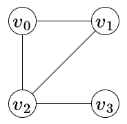
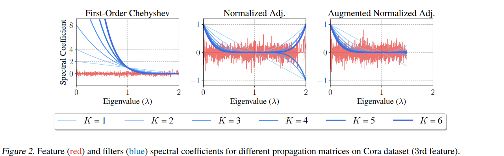

# 1. 图拉普拉斯矩阵的定义

给定图 $\mathcal{G} = (\mathcal{V}, \mathcal{E})$，其拉普拉斯矩阵的定义如下：
$$ L = D - A = \begin{cases}
deg(i), & i==j \\
-1, & e_{ij} \in  \mathcal{E} \\
0, & otherwise
\end{cases}$$
其中 $D$ 表示度矩阵，$A$ 为邻接矩阵。我们可以看出，拉普拉斯矩阵主对角线第 $i$ 个矩阵表示第 $i$ 个节点的度， 即 
$$D_{ii} = \sum_{j} A_{ij}$$
可以看出拉普拉斯矩阵是一个实对称阵，且行元素之和为0。

对于图1，它的度矩阵$D$，邻接矩阵$A$和拉普拉斯矩阵$L$分别为：
$$D=\left[ \begin{matrix}
2 & 0 & 0 & 0 \\
0 & 2 & 0 & 0 \\
0 & 0 & 3 & 0 \\
0 & 0 & 0 & 1
\end{matrix}\right]$$
$$A=\left[ \begin{matrix}
0 & 1 & 1 & 0 \\
1 & 0 & 1 & 0 \\
1 & 1 & 0 & 1 \\
0 & 0 & 1 & 0
\end{matrix}\right]$$
$$L=\left[ \begin{matrix}
2 & -1 & -1 & 0 \\
-1 & 2 & -1 & 0 \\
-1 & -1 & 3 & -1 \\
0 & 0 & -1 & 1
\end{matrix}\right]$$

# 2. 拉普拉斯算子
拉普拉斯矩阵的定义来源于拉普拉斯算子，后者是 $n$ 维欧氏空间的二阶微分算子(用于计算散度)
$$\Delta f = \nabla^2 f = \nabla \cdot \nabla f = \sum_{i=1}^n \frac{\partial ^2 f}{\partial x_i^2}$$
如果把图拉普拉斯矩阵看作是线性变换的话，它的作用与数学分析中的拉普拉斯算子是一样的。下面使用泰勒级数来推导。

首先假设离散空间最少单位步长单位 $h$，即
$$x_{i+1} - x_i = h$$
$$x_i - x_{i-1} = h$$
然后使用泰勒级数将函数 $f(x_{i+1})$ 和 $f(x_{i-1})$ 的函数值再 $x_i$ 处展开，可以得到：
$$f(x_{i+1}) = f(x_i) + f^{'}(x_i)h + \frac{f^{''}(x_i)}{2!}h^2 + O(h^2) \tag{1}$$
$$f(x_{i-1}) = f(x_i) - f^{'}(x_i)h + \frac{f^{''}(x_i)}{2!}h^2 + O(h^2) \tag{2}$$
如果直接求解 $f^{'}(x_i)$，其截断误差都是 $O(h)$，为了进一步减小误差，可以使上下两式相减，可以得到
$$f^{'}(x_i) = \frac{f(x_{i+1})-f(x_{i-1})}{2} - O(h^2) \tag{3}$$
可以看到，（3）式的误差变成了 $O(h^2)$。利用同样的方法推导 $f^{''}(x_i)$，让（1）和（2）式相加，可以得到
$$f^{''}(x_i) = \frac{f(x_{i+1})+f(x_{i-1}) - 2f(x_i)}{h^2} - O(h^3) \tag{4}$$
因此，可以将其表示为
$$\Delta f = f(x_{i+1})+f(x_{i-1}) - 2f(x_i) $$
如果将其离散到二维空间，就变成了边缘检测算子，描述中心像素与局部上下左右四个邻居之间的差异
$$\Delta f(x,y) = \left[ f(x+1, y) + f(x-1, y) + f(x, y+1) + f(x, y-1) \right]-4 f(x,y)\tag{5}$$

如果在图信号中，拉普拉斯算子被用来描述中心节点和邻居节点之间的差异，

$$Lx= \left[ \begin{array}{c} 
\sum_{j\in \mathcal{N}(1)} (x_1 - x_j) \\
\sum_{j\in \mathcal{N}(2)} (x_2 - x_j) \\
\vdots \\
\sum_{j\in \mathcal{N}(n)} (x_n - x_j) \\
\end{array}\right] $$
实际上拉普拉斯矩阵可以看做一个差分算子，第 $i$ 只与第 $i$ 个图节点及其一阶邻居节点有关，因此它反映了图信号局部平滑度的算子。

# 3. Normalized Laplacian Matrix

为什么要对拉普拉斯矩阵做归一化呢？因为根据拉普拉斯矩阵进行计算时相当于采用加法规则，即把邻居节点的信息不断地聚合过来。这样就会导致度数大的节点特征会越来越大，而度数小的节点特征会越来越小。因此我们需要对拉普拉斯矩阵进行归一化。

## 3.1 Random Walk based Normalization

$$L_{rw}=D^{-1}L = I - D^{-1}A = \frac{1}{D_{ii}} A_{ij} = \begin{cases} 
1 & i=j \quad and \quad A_{ij} = 0  \\
\frac{-1}{D_{ii}} & i \neq j \quad and \quad A_{ij}=1\\
0 & i \neq j \quad and \quad A_{ij} = 0 
\end{cases} \tag{5}$$

以图1为例，它的归一化拉普拉斯矩阵为
$$L_{rw}=\left[ \begin{matrix}
1 & -\frac{1}{2} & -\frac{1}{2} & 0 \\
-\frac{1}{2} & 1 & -\frac{1}{2} & 0 \\
-\frac{1}{3} & -\frac{1}{3} & 1 & -\frac{1}{3} \\
0 & 0 & -1 & 1
\end{matrix}\right]$$

我们可以看出，这种归一化方法的核心思想是对邻居求和取平均。但是我们可以看出来该方法得到的归一化矩阵不是对称的。而且这种方式仅考虑节点自身的度，没有考虑邻居节点的度。例如在更新节点$v_2$的特征时，由于$v_3$只与$v_2$相连，而$v_1$与$v_2$和$v_0$相连，显然$v_3$对$v_2$的忠诚度更高。

> 解释：假如有A和B两个节点，A有1000个邻居，B只有A一个邻居。假定A对B的影响力和B对A的影响力是相同的，但是由于B只能接受A一个邻居的信息，A能接受1000个邻居节点的信息。
> *但这里有一个疑问，按理说双方的影响力是不同的。不一定适合所有场景吧*。

## 3.2 Symmetric Normalization
$$L_{sym}=D^{-\frac{1}{2}}LD^{-\frac{1}{2}} = \begin{cases} 
1 & i=j \quad and \quad A_{ij} = 0  \\
\frac{-1}{\sqrt{D_{ii} \cdot D_{jj}}} & i \neq j \quad and \quad A_{ij}=1\\
0 & i \neq j \quad and \quad A_{ij} = 0 
\end{cases} \tag{6}$$

从公式（6）中我们可以看出，对称归一化得到的拉普拉斯矩阵具有对称性，它同时考虑了自身和邻居节点的度。以图1为例，它的对称归一化拉普拉斯矩阵如下。

$$\begin{split}L_{sym}&=D^{-\frac{1}{2}}LD^{-\frac{1}{2}}\\
&= \left[\begin{matrix}
\frac{1}{\sqrt{2}} & 0 & 0 & 0 \\
0 & \frac{1}{\sqrt{2}} & 0 & 0 \\
0 & 0 & \frac{1}{\sqrt{3}} & 0 \\
0 & 0 & 0 & 1
\end{matrix}\right] \left[\begin{matrix}
2 & -1 & -1 & 0 \\
-1 & 2 & -1 & 0 \\
-1 & -1 & 3 & -1 \\
0 & 0 & -1 & 1
\end{matrix}\right] \left[\begin{matrix}
\frac{1}{\sqrt{2}} & 0 & 0 & 0 \\
0 & \frac{1}{\sqrt{2}} & 0 & 0 \\
0 & 0 & \frac{1}{\sqrt{3}} & 0 \\
0 & 0 & 0 & 1
\end{matrix}\right] \\
&= \left[\begin{matrix}
\frac{1}{\sqrt{2}} & 0 & 0 & 0 \\
0 & \frac{1}{\sqrt{2}} & 0 & 0 \\
0 & 0 & \frac{1}{\sqrt{3}} & 0 \\
0 & 0 & 0 & 1
\end{matrix}\right] \left[\begin{matrix}
\frac{2}{\sqrt{2}} & -\frac{1}{\sqrt{2}} & -\frac{1}{\sqrt{3}} & 0 \\
-\frac{1}{\sqrt{2}} & \frac{2}{\sqrt{2}} & -\frac{1}{\sqrt{3}} & 0 \\
-\frac{1}{\sqrt{2}} & -\frac{1}{\sqrt{2}} & \frac{3}{\sqrt{3}} & -1 \\
0 & 0 & -\frac{1}{\sqrt{3}} & 1
\end{matrix}\right] \\
&= \left[\begin{matrix}
1 & -\frac{1}{2} & - \frac{1}{\sqrt{3}} & 0 \\
-\frac{1}{2} & 1 & -\frac{1}{\sqrt{6}} & 0 \\
-\frac{1}{\sqrt{6}} & -\frac{1}{\sqrt{6}} & 1 & \frac{1}{\sqrt{3}} \\
0 & 0 & -\frac{1}{\sqrt{3}} & 1
\end{matrix}\right]
\end{split}$$

## 3.2.1 对称归一化拉普拉斯矩阵的特征值

**结论**：$0=\lambda_0 < \lambda_1 \le \lambda_2 \le \cdots \le \lambda_{max} = 2$。 当且仅当图G是二部图(bipartite)时，$\lambda_{max}=2$。

证明：这里证明需要用到瑞利熵，$R(A,x)=\frac{x^T A x}{x^T x}$，它具有如下性质 $\lambda_{min} = min(R) \le R \le max(R) = \lambda_{max}$。对于$L_{sym}$和任意向量$g$，它们的瑞利熵可以表示为：
$$\begin{split}
R(L_{sym}, g)&=\frac{g^T D^{-1/2} L D^{-1/2} g}{g^T g} = \frac{\left(D^{-1/2} g\right)^T L \left( D^{-1/2} g \right)}{g^T g} \\
&= \frac{f^T L f}{\left( D^{1/2} f \right)^T \left( D^{1/2} f \right)} \\
&= \frac{\sum_i f^2(i) d_i - \sum_i \sum_{j \land A_{ij}=1} f(i)(j)}{\sum_i f^2(i)d_i} \\
&= \frac{\frac{1}{2} \left( \sum_i f^2(i)d_i + \sum_j f^2(j)d_j - \sum_i \sum_{j \land A_{ij}=1} 2f(i)(j) \right)}{\sum_i f^2(i)d_i} \\
&= \frac{\frac{1}{2} \sum_i \sum_{j \land A_{ij}=1} (f(i) - f(j))^2}{\sum_i f^2(i)d_i} \\
&=  \frac{\sum_{j \land A_{ij}=1} (f(i) - f(j))^2}{\sum_i f^2(i)d_i}
\end{split} \tag{8}$$

上式中，$f$可以看作是每个节点上的信号函数。最后一行是因为节点$i,j$互为邻居，既可以是 $\sum_{j \land A_{ij}=1}$，也可以是 $\sum_{j \land A_{ji}=1}$, 因此重复计算了。

根据公式(8)，我们可以看出 $R(L_{sym},g) \ge 0$，且当 $f(i)=f(j)$ 时取等号。

+ 如果令 $g=(\sqrt{d_1}, \sqrt{d_2}, \cdots, \sqrt{d_n})$，则 $f = D^{-1/2} g = (1, 1, \cdots, 1)$。因此 0 是 $L_{sym}$ 的最小特征值。
+ 因为 $(f(i) - f(j))^2 \le 2(f^2(i) + f^2(j))$，因此我们可以得到$R(L_{sym}, g) = \frac{\sum_{j \land A_{ij}=1} (f(i) - f(j))^2}{\sum_i f^2(i)d_i} \le \frac{2\sum_{j \land A_{ij}=1} (f(i) + f(j))^2}{\sum_i f^2(i)d_i} = 2$

取得等于号的条件是对于任意的 $f(x) + f(y) = 0$。根据二部图的定义，如果G为二部图，那么G至少有两个顶点，且其所有回路长度均为偶数。套用该条件，假定二部图左侧均为正，右侧均为负，满足条件。

# 4. 拉普拉斯矩阵与图神经网络

最开始的图卷积网络是基于谱域思想的，作者将图的拉普拉斯矩阵的特征向量作为基底，然后将样本变换到谱域空间后，再对不同频率的信息进行操作，最后再从谱域变换回来。核心是设计频率响应矩阵，对频率响应矩阵进行参数化，通过训练的方式来让图滤波器（图卷积）自动地调整和取舍不同频段的信息，从而提取出有用的特征。但该方法依赖于矩阵分解，且每一步都要做傅里叶变换和逆变换，计算开销过大。而且，根据研究成果，图中的有效信息往往蕴含在低频段，没有必要为每个频段训练一个参数。

> 这里低频与高频主要是指小的特征值与大的特征值对应的频段。

之后， Kipf等人不再花费大量的时间去求特征值，改为直接在节点层面进行滤波操作。它们将节点层面的滤波定义为： 某个节点K阶子图上所有节点（包括自身）的信号值的线性组合。
$$f_{out}(i) = b_{i,i} f_{in}(i) + \sum_{j\in \mathcal{N}(i,K)} b_{i,j} f_{in}(j) \tag{9}$$
公式（9）中$\mathcal{N}(i,K)$ 表示节点$i$的第1阶至第K阶邻居节点。当频率响应函数是K阶多项式时，节点$i$在频域内的滤波结果是周围1至K阶邻居节点信号值的线性组合，文献[1]中有详细的解释。可以直接使用拉普拉斯矩阵的多项式函数来逼近任意一个滤波器，甚至，不去计算特征值，利用切比雪夫多项式近似法。

切比雪夫多项式来源于n倍角公式，每一项可以通过迭代的方式得到，第K项满足
$$T_k(x) = 2x T_{k-1}(x) - T_{k-2}(x), T_0 = 1, T_1 = x \tag{10}$$
于是，可以使用截断的K阶切比雪夫多项式来表示图卷积操作：
$$g_\theta(\Lambda) = \sum_{k=0}^K \theta_k T_k(\overline{\Lambda}), \overline{\Lambda} = \frac{2\Lambda}{\lambda_{max}} - I_n \tag{11}$$
将特征值进行缩放和偏移处理的目的是为了让其范围为[-1, 1]，从而使卷积操作成为一种压缩映射，避免堆叠多层导致某些频段信号被指数级放大。

滤波之后的图信号为：
$$y = g_\theta(\overline{L})x = \sum_{k=0}^K \theta_k T_k (\overline{L})x \overline{L} = \frac{2L_{sym}}{\lambda_{max}} - I_n \tag{12}$$

前文证明过，$L_{sym}$的特征值范围为[0,2]，因此经过放缩之后，特征值的范围为[-1, 1]。

# 5 重归一化拉普拉斯矩阵与GCN

## 5.1 动机

在实际应用场景中，如果K值取值过高，那么对于包含度数较大的节点的图来说，一个卷积层的感受野很有可能覆盖几乎整张图，这样的话，即使堆叠了几层卷积层，后续卷积层的感受野仍然是整张图，重复执行全局平均操作，最终会导致输出图信号过平滑。

为了缩小每一层的感受野，同时降低每一层的计算量，我们固定K=1， 根据归一化拉普拉斯矩阵的最大特征值为$\lambda_{max} \approx 2$，得到一阶近似切比雪夫多项式：
$$y=\theta_0 x + \theta_1 (L-I_n)x = \theta_0 x - \theta_1 D^{-1/2} A D^{-1/2} x \tag{13} $$
为了参数统一，设$\theta_0 = - \theta_1 = \theta$, 则可以得到
$$y = \theta(I_n + D^{-1/2}A D^{-1/2}) x = Hx \tag{14}$$
由于 $I_n + D^{-1/2}A D^{-1/2} = I_n + D^{-1/2}(I_n - L)D^{-1/2} = 2I_n - L_{sym} $，它的特征值范围是[0,2]，连读堆叠这样的卷积层相当于引入了频率响应函数 $(2-\lambda_i)^K$，会过度放大 $\lambda_i <1$ 频段的信号，进而引发某些参数梯度爆炸，另外一些参数梯度消失。

## 5.2 方法

为此，Kipf等人提出了重归一化操作（Renormalization Trick），为每个节点加上自环，得到新的邻接矩阵和度矩阵：
$$\tilde{A} = A+I_n, \tilde{D} = D+I_n \tag{15}$$
此时，归一化拉普拉斯矩阵变为：
$$\tilde{L}_{sym} = \tilde{D}^{-1/2}(\tilde{D} - \tilde{A}) \tilde{D}^{-1/2} = \tilde{D}^{-1/2} L \tilde{D}^{-1/2} $$
使用单位阵减去$\tilde{L}_{sym}$，可以得到：
$$L_{renorm} = I_n - \tilde{D}^{-1/2} L \tilde{D}^{-1/2} = \tilde{D}^{-1/2} \tilde{A} \tilde{D}^{-1/2} \tag{16}$$
因为公式（16）可以重写为
$$L_{renorm} = I_n - \tilde{L}_{sym} = \tilde{U}^T I_n \tilde{U} - \tilde{U}^T \tilde{\Lambda} \tilde{U} = \tilde{U}^T (I_n - \tilde{\Lambda}) \tilde{U} \tag{17}$$
因此，$L_{renorm}$的频率响应函数为 $(1-\tilde{\lambda}_i)^K$，解决了低频段信号被过度放大的问题。

## 5.3 优势

本文中提到了以下三种归一化矩阵：

+ 归一化邻接矩阵 $D^{-1/2} A D^{-1/2}$，未加自环，频率响应函数为 $(1-\lambda_i)^K$

+ 一阶近似切比雪夫多项式 $I_n + D^{-1/2} W D^{-1/2}$的频率响应函数 $(2 - \tilde{\lambda}_i)^K$

+ 重归一化拉普拉斯矩阵 $\tilde{D}^{-1/2} \tilde{A} \tilde{D}^{-1/2}$ 的频率响应函数 $(1 - \tilde{\lambda}_i)^K$ 

上述三者的特征值范围都是[0,2)，唯一的区别是，加入了自环之后，重归一化拉普拉斯矩阵的最大特征值小于归一化拉普拉斯矩阵的最大特征值，即 
$$0 = \lambda_1 = \tilde{\lambda}_1 < \tilde{\lambda}_n < \lambda_n < 2 \tag{18}$$
公式（18）的证明可以参考 [Simplifying Graph Convolutional Networks](https://arxiv.org/pdf/1902.07153v1.pdf) 一文附录中关于Theorem 1 的证明。

最左侧是一阶近似切比雪夫多项式方法，它过度放大了低频信号；中间是未加自环的归一化拉普拉斯矩阵，它不存在过度放大低频信号的问题，但它却放大了高频信号的强度，以及当阶数为奇数时，放大系数为负数；最后一个是重归一化拉普拉斯矩阵的频率响应函数，由于最大特征值被压缩了，所以过度放大问题被解决了。

因此可以用 $L_{renorm}$ 为核心设计图卷积层：
$$Z = \sigma \left( \tilde{D}^{-1/2} \tilde{W} \tilde{D}^{-1/2} X \Theta \right), where \quad \Theta\in\mathbb{R}^{f_{in} \times f_{out}} \quad and \quad Z \in \mathbb{R}^{N\times f_{out}} \tag{19}$$
公式（19）中X为如向量信号，$\Theta$是可训练的线性变换，用户表示通道映射。

# 参考
1. [图卷积网络原来是这么回事 - Cosmic being的文章 - 知乎](https://zhuanlan.zhihu.com/p/297613044)
2. [图的拉普拉斯矩阵的特征值范围的一个估计 - 小明教主的文章 - 知乎](https://zhuanlan.zhihu.com/p/65447367)
3. [【图神经网络基础】理解GCN的对称归一化操作-图的拉普拉斯归一化 - 一穷二白到年薪百万](https://blog.csdn.net/zfhsfdhdfajhsr/article/details/124552753)
4. [对称归一化拉普拉斯矩阵的意义 - 马东什么的文章 - 知乎](https://zhuanlan.zhihu.com/p/412337460)
5. [GCN 为什么是低通滤波器？具体在干啥？ - yang lebron的文章 - 知乎](
https://zhuanlan.zhihu.com/p/142640571)

