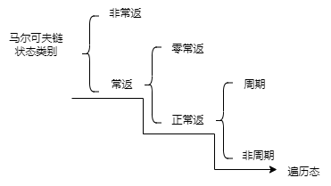
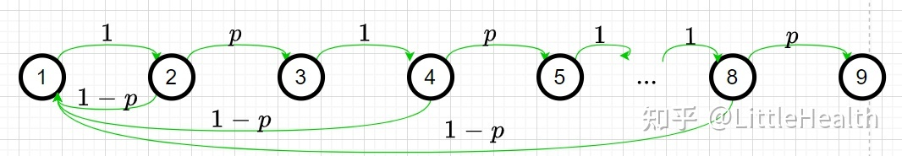

# 1. 背景知识

## 1.1 采样的动机

1. 采样本身就是常见的任务，例如从生成模型 $P(\mathbf{x})$ 中采样出样本。
2. 求积分或者复杂求和。例如，求 $\int p(\mathbf{x})f(\mathbf{x})dx$ 可以转化为 $\mathbb{E}_{x \sim p(\mathbf{x})} \left[f(\mathbf{x})\right]$，从 $p(\mathbf{x})$ 中采样出 $N$ 个样本，求解 $\frac{1}{N}\sum_{i=1}^N f(\mathbf{x}^{i})$

> 根据李航老师的《统计学习方法》，假设多元随机变量 $\mathbf{x}\in\mathcal{X}$， 其概率密度函数为 $p(\mathbf{x})$， $f(\mathbf{x})$ 为定义在 $\mathbf{x}\in\mathcal{X}$ 上的函数，采样的目标是获得概率分布为 $p(\mathbf{x})$ 的样本集合，以及求函数 $f(\mathbf{x})$ 的数学期望 $\mathbb{E}_{p(\mathbf{x})}[f(\mathbf{x})]$。

## 1.2 如何衡量采样的质量？（什么是好的样本？）

1. 样本趋向于高概率区域，同时兼顾其他区域。以高斯分布为例，我们希望绝大多数样本位于 $3\sigma$ 之间。
2. 样本之间要相互独立的，即相关性不强。

以选举为例，我们希望按照人数比例选举代表。例如绝大多数是工人和农民，我们希望绝大多数代表是工人和农民（性质1）；而且这些代表应该是不同工厂和农场的，不是同一家工厂或同一个家族的（性质2）。

## 1.3 采样是困难的

1. 配分函数是不可解的。即 $p(\mathbf{x}) = \frac{\hat{p}(\mathbf{x})}{Z} = \frac{\hat{p}(\mathbf{x})}{\int \hat{p}(\mathbf{x}) d \mathbf{x}}$
2. 高维环境下，状态空间过于复杂，无法通过遍历的方式覆盖所有状态空间。直接采样不可行。

# 2. 马尔可夫链

## 2.1 基本定义

假设在时刻0的随机变量 $\mathbf{x}_0$ 遵循概率分布 $P(\mathbf{x}_0)=\pi_0$，称为初始状态分布，在某个时刻 $t \ge 1$ 的随机变量 $\mathbf{x}_t$ 与前一个时刻的苏基变量 $\mathbf{x}_{t-1}$ 之间有条件分布 $P(\mathbf{x}_t |\mathbf{x}_{t-1})$， 如果 $\mathbf{x}_t$ 只依赖于 $\mathbf{x}_{t-1}$， 而不依赖于过去的随机变量 $\{\mathbf{x}_0, \mathbf{x}_1, \ldots, \mathbf{x}_{t-2}\}$，这一性质称为马尔可夫性，即：

$$P(\mathbf{x}_t|\mathbf{x}_0, \mathbf{x}_1, \cdots, \mathbf{x}_{t-1}) = P(\mathbf{x}_t |\mathbf{x}_{t-1}) \quad t=1,2,\cdots \tag{1}$$

具有马尔可夫性的随机序列 $\mathbf{X} = \{\mathbf{x}_0,\mathbf{x}_1, \cdots, \mathbf{x}_{t}, \cdots\}$ 称为马尔可夫链（Markov Chain）或者马尔可夫过程（Markov Process）。

马尔可夫性的直观解释是“未来只依赖于现在（假设现在已知），而与过去无关”。

## 2.2 离散状态马尔可夫链

### 2.2.1 转移概率矩阵和状态分布

离散状态马尔可夫链 $\mathbf{X} = \{\mathbf{x}_0,\mathbf{x}_1, \cdots, \mathbf{x}_{t}, \cdots\}$， 随机变量 $\mathbf{x}_t (t=0,1,2,\cdots)$ 定义在离散空间 $\mathcal{S}$，转移概率分布可以用矩阵表示。如果马尔可夫链在时刻 $(t-1)$ 处于状态 $j$, 在 $t$ 时刻移动到状态 $i$， 则转移概率记作：
$$p_{ij} = (\mathbf{x}_t = i | \mathbf{x}_{t-1} = j), \quad i=1,2,\cdots; \quad j=1,2,\cdots \tag{2}$$
满足
$$p_{ij}\ge0, \sum_i p_{ij} = 1$$
转移概率矩阵可以写为：
$$\boldsymbol{P} = \left[\begin{matrix}
p_{11} & p_{12} & p_{13} & \cdots \\
p_{21} & p_{22} & p_{23} & \cdots \\
p_{31} & p_{32} & p_{33} & \cdots \\
\cdots & \cdots & \cdots & \cdots \\
\end{matrix}\right] \tag{3}$$

转移概率矩阵 $\boldsymbol{P}$ 满足公式（2）性质，且满足这两个条件的矩阵通常被称为随机矩阵（Stochastic Matrix）。注意，这里矩阵列之和为1，表示从状态 $j$ 转换至状态空间 $\mathcal{S}$ 中任意状态的概率之和为1. 

将马尔可夫链在 $t$ 时刻的概率分布称为 $t$ 时刻的状态分布，记作：
$$\pi(t)=\left[\begin{matrix}
\pi_1(t)\\
\pi_2(t)\\
\vdots
\end{matrix}\right] \tag{4}$$
其中 $\pi_i(t)$ 表示时刻 $t$ 状态为 $i$ 的概率 $P(\mathbf{x}_t = i)$，
$$\pi_i(t) = P(\mathbf{x}_t = i) \quad i=1,2,\cdots \tag{5}$$
这里 $\sum_i \pi_i(t) = 1$。特别地，马尔可夫链的初始状态分布可以表示为
$$\pi(0)=\left[\begin{matrix}
\pi_1(0)\\
\pi_2(0)\\
\vdots
\end{matrix}\right] \tag{6}$$

马尔可夫链 $X$ 在 $t$ 时刻的状态分布，可以由 $(t-1)$ 时刻的状态分布及转移概率分布决定：
$$\pi(t) = P\pi(t-1) \tag{7}$$
这是因为
$$\begin{split}
\pi_i(t) &= P(\mathbf{x}_t = i) \\
&= \sum_{m\in \mathcal{S}} P(\mathbf{x}_t = i|\mathbf{x}_{t-1}=m) P(\mathbf{x}_{t-1} = m) \\
&= \sum_{m\in\mathcal{S}} p_{im} \pi_m(t-1) 
\end{split}\tag{8}$$

马尔可夫链在 $t$ 时刻的状态分布可以通过递推得到，根据公式（7），我们可以得到
$$\pi(t)=\boldsymbol{P} \pi(t-1)=\boldsymbol{P} (\boldsymbol{P} \pi(t-2))=\boldsymbol{P} ^2\pi(t-2)=\cdots=\boldsymbol{P} ^t\pi(0) \tag{9}$$
其中 $P^t$ 称为 $t$ 步转移概率矩阵，
$$p_{ij}^t = P(\mathbf{x}_t=i|\mathbf{x}_0=j)\tag{10}$$
表示时刻0从状态 $j$ 触发，时刻 $t$ 到达状态 $i$ 的 $t$ 步转移概率。

尤其是，当t=0时，做如下规定：
$$p_{ij}^0 = \begin{cases}
0, \quad & i \neq j\\
1, \quad & i = j
\end{cases}\tag{11}$$
我们可以认为初始状态下，节点状态保持不变，不会发生状态转移。

### 2.2.2 Champman-Kolmogorov 方程，简称CK方程
CK方程旨在描述 $p_{ij}^t$ 和 $p_{ij}$ 之间的关系，对于一切 $t,n \ge 0, i,j \in \mathcal{S}$，有以下二式成立：

+ $$p_{ij}^{t+n} = \sum_{k\in\mathcal{S}} p_{ik}^t p_{kj}^n \tag{12}$$
+ $$\boldsymbol{P}^t = \boldsymbol{P} \cdot \boldsymbol{P}^{t-1} \tag{13} $$ 

## 2.3 马尔可夫链的性质

> **前言**
> 马尔可夫链的性质是与马尔可夫链的状态划分密切相关的，所有状态如图1所示，通俗解读如下：
>
> + 非常返： 不确定事情不一定会发生，例如买彩票中特等奖
> + 常返：事情一定会发生，例如抛硬币早晚会抛到正面
> + 正常返：事情经过有限步会发生
> + 零常返：事情要经过无穷步才会发生，例如取到标准正态分布的一个点
> + 周期的：在马尔可夫链中，从该状态触发，再返回该状态时时间间隔为 $d \ge 2$（注意，这里不一定是完整的周期）
> + 非周期：周期为1
> + 遍历态： 不可约，非周期，且正常返

### 2.3.1 可约（连通）/不可约

$\color{green}{\textbf{定义 1 }}$如果存在 $n \ge 0$，使得 $p_{ij}^{(n)}>0$，记为 $j \rightarrow i$，称为状态 $j$ 可达状态 $i$（$i,j\in\mathcal{S}$）。如果同时有 $i \rightarrow j$，则称状态 $j$ 与 $i$ 互通，记为 $ j \leftrightarrow i$。

$\color{red}{\textbf{定理 1 }}$ 互通是一种等价关系，即满足以下三个性质：

+ 自返性： $i \leftrightarrow i$

+ 对称性： $j \leftrightarrow i$ 则 $i \leftrightarrow j$

+ 传递性： $k \leftrightarrow j, j \leftrightarrow i$，则 $k\leftrightarrow i$

$\color{green}{\textbf{定义 2 }}$ 我们把任何两个互通状态归为一类，由上述定理可知，同在一类的状态应该都是互通的，并且任何一个状态不能同属于两个不同的类。**如果Markov链只存在一个类，就称它是不可约的（irreducible），否则称为可约的（reducible）。**

### 2.3.2 周期/非周期

$\color{green}{\textbf{定义 3 }}$ 如果集合 $\{n: n\ge 1, p_{ii}^{(n)}>0\}$ 非空，则称它的最大公约数 $d=d(i)$ 为 $i$ 的周期。**如果 $d>i$，则称 $i$ 是周期的（periodic）；如果 $d=1$， 则称 $i$ 是非周期的（aperiodic）**。并且特别规定，当上述集合为空集时，$i$ 的周期无穷大。

对于一个马尔可夫链 $X$ 来说，若所有状态的周期均为1，称该链是非周期的，否则是周期的。

$\color{red}{\textbf{定理 2 }}$ 如果状态 $j,i$同属一类，则 $d(i)=d(j)$。

$\textbf{证明} \quad$ 由类的定义可知 $j \leftrightarrow i$，即存在 $n,m \ge 0$，使得 $p_{ij}^n > 0, p_{ji}^m$，则 $p_{ii}^{n+m} = \sum_{k\in\mathcal{S}} p_{ik}^n p_{ki}^m \ge p_{ij}^n p_{ji}^m >0$。对于所有 $p_{jj}^l >0$的 $l$，有 $p_{ii}^{(n+l+m)} \ge p_{ij}^n p_{jj}^{(l)}  p_{ji}^m >0$。显然 $d(i)$ 应该同时整除 $n+m$ 和 $n+l+m$，则它必定整除 $l$。而 $d(j)$是 $j$ 的周期，所以 $d(i)$必定整除 $d(j)$。反过来亦可证 $d(j)$ 整除 $d(i)$，于是 $d(i) = d(j)$。

### 2.3.3 常返/非常返

$\color{green}{\textbf{定义 4 }}$ 对于任何状态$i,j$，以 $f_{ij}^{(n)}$ 记录从 $j$ 出发经过 $n$ 步后首次到达 $i$ 的概率。令 $f_{ij} = \sum_{n=1}^{\infty}f_{ij}^{(n)}$，如果 $f_{jj}=1$，则称状态 $j$为常返状态；若 $f_{jj}<1$，则称状态 $j$ 为非常返状态或瞬过状态。

> 常返与否可以理解为从 $j$ 出发未来某个时刻是否一定能回到 $j$。

### 2.3.4 正常返/零常返

对于常返的状态 $j$，定义
$$\mu_i = \sum_{n=1}^{\infty} n f_{ii}^{(n)} \tag{14}$$
为从状态 $i$ 出发返回状态 $i$ 所需的平均步数。

$\color{green}{\textbf{定义 5 }}$ 对于常返状态 $i$， 如果 $\mu_i < +\infty$，则称 $i$ 为正常返（positive recurrent）状态；若 $\mu_i = + \infty$，则称 $i$ 为零常返状态。

举例： 根据级数的发散思维，如果 $p=\frac{1}{2}$ 时， $f_{11}^{(2)} = \frac{1}{2}, f_{11}^{(4)} = \frac{1}{2^2}, f_{11}^{(8)} = \frac{1}{2^3}, \cdots$，其余为0，所以
$$f_{11} = 0+\frac{1}{2} + 0+ \frac{1}{2^2} + 0 + 0 +0 + \frac{1}{2^3} + \cdots = 1$$
$$\mu_1 = 0 + \frac{2}{2} + 0 + \frac{4}{2^2} + 0+ 0+ 0+ \frac{8}{2^3} + \cdots = \infty$$
因此是零常返。如果令 $p=\frac{1}{4}$，$f_{11}^{(2)} = \frac{3}{4}, f_{11}^{(4)} = \frac{3}{4^2}, f_{11}^{(8)} = \frac{3}{4^3}, \cdots$，其余为0，所以
$$f_{11} = 0+\frac{3}{4} + 0+ \frac{3}{4^2} + 0 + 0 +0 + \frac{3}{4^3} + \cdots = 1$$
$$\mu_1 = 3\times ( 0 + \frac{2}{4} + 0 + \frac{4}{4^2} + 0+ 0+ 0+ \frac{8}{4^3} + \cdots) = 3$$

，因此是正常返的。**本质原因还是因为返回的概率增大了。**

$\color{blue}{\textbf{推论 1 }}$

# 参考

1. [统计机器学习](www.baidu,com)
2. [应用随机过程](www.douban.com)
3. [白板推导](www.bilibili.com)
4. [如何理解马尔科夫链中的常返态，非常返态，零常返，正常反，周期和非周期，有什么直观意义？ - uplow的回答 - 知乎](https://www.zhihu.com/question/46539491/answer/263442039)
5. [如何理解马尔科夫链中的常返态，非常返态，零常返，正常反，周期和非周期，有什么直观意义？ - LittleHealth的回答 - 知乎](https://www.zhihu.com/question/46539491/answer/2177451474)