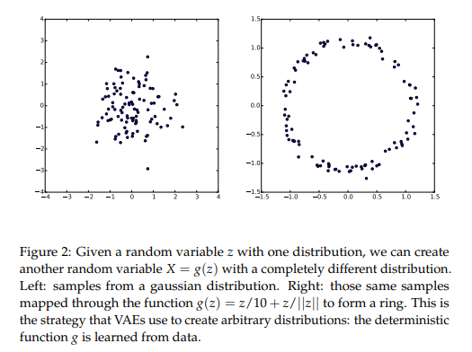
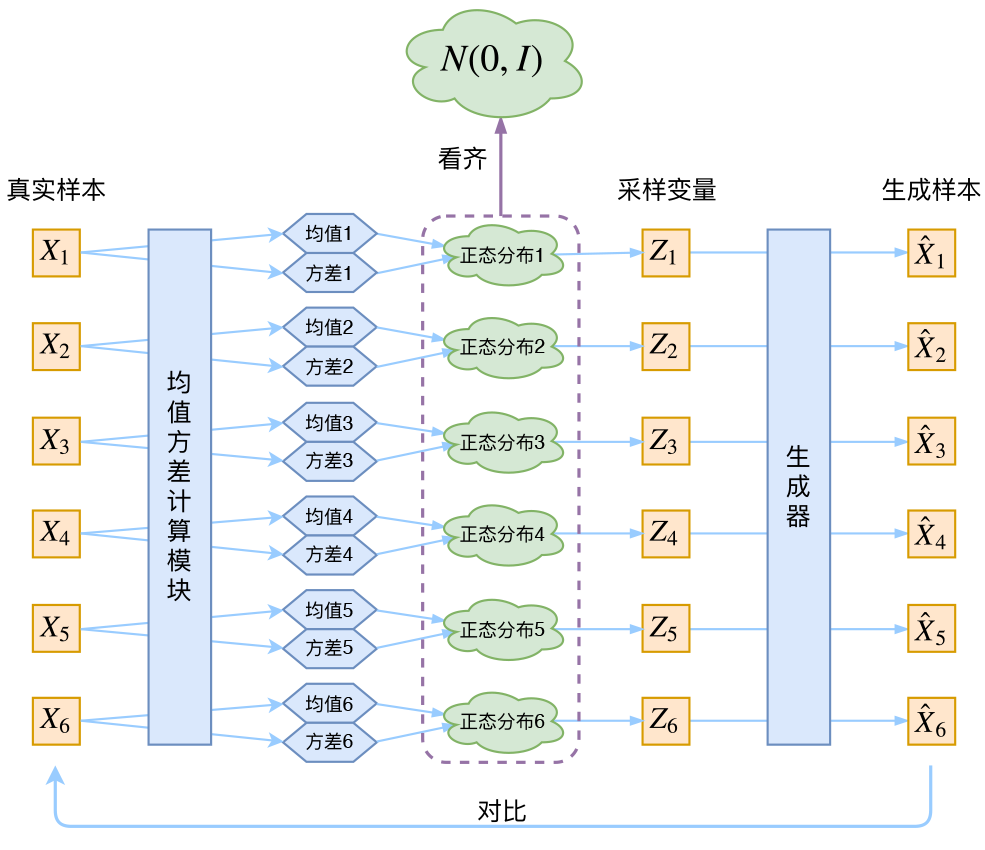
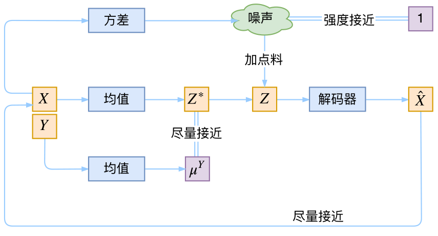

# 1 生成类模型
<a id="sec1"></a>

深度学习模型总体来讲可以概括为判别类模型（Discriminative）和生成类模型（Generative）。对于样本集合$\mathcal{X}=\{X^{(1)}, X^{(2)}, \cdots, X^{(n)}, \cdots\}$，判别类模型主要是输出每个样本对应的标签，而生成类模型则会度量样本的分布$P(X)$并能够生成新的样本。

生成类模型在生成数据时可以使用Latent Variable Model。因为相同类别的数据在不同的维度之间存在依赖。以生成手写数字为例，在生成手写数字5时，如果已经生成了数字5的左半部分，即使没有右半部分，也可以判定是数字5. 因此，生成类模型在生成数据时可以考虑两个步骤，**第一步决定生成什么数字，这个数字使用隐变量$z$表示，第二步根据$z$生成对应的数字**。该过程可以表示如下：
$$P(X) = \int P(X|z;\theta)P(z)dz \tag{1}$$

在这个过程中，度量隐变量$z$的分布是困难的，因为在深度学习背景下，生成的数据维度很高，不同维度之间可能存在依赖。VAE假定任意隐变量$z$可以从一个标准正态分布中得到，并通过一个足够复杂的函数映射将隐变量映射为任意一个分布。如图1所示，我们可以利用函数 $g(z)=\frac{z}{10} + \frac{z}{||z||}$ 将一个二维高斯分布映射为环形。


# 2. VAE

## 2.1 VAE基本思想
根据[章节1](#sec1)，我们可以看出，只要有足够强大的函数估计器，我们就可以得到任意分布的隐含变量$z$，因此，我们可以使用神经网络来构建这个函数估计器。从而最大化公式（1）。

当有了隐变量$z$的先验分布，很容易想到使用多次采样的方式来最大化似然函数
$$P(X) \approx \frac{1}{n} \sum_{i=1}^{n} P(X^{(i)}|z^{(i)}) \tag{2}$$
但是这种方法在高维空间十分低效。

为此，VAE并没有使用$P(z)$（先验分布）是正态分布的假设，而假设$P(z|X^{(i)})$（后验分布）是正态分布。具体来讲，对于任意真实样本$X^{(i)}$，我们假设存在一个专属于 $X^{(i)}$ 的多元正态分布。强调专属是因为后面要训练一个生成器$X=g(z)$，希望能够把从分布$P(z|X)$中采样的$z^i$还原为$X^{(i)}$。如果直接假设$P(z)$服从正态分布并随便采样出一个$z$，那样就无法知道这个采样出的$z$对应于哪个真实样本。而现在$P(z|X^{(i)})$专属于样本$X^{(i)}$，这样就有充分的理由认为从这个样本中采样出的$z$应当还原为样本$X^{(i)}$。

这样一来，每一个样本 $X^{(i)}$ 都配备了一个专属的正态分布以方便后面的生成器做还原。这样一来有多少样本就会有多少个正态分布了。为此，我们需要求解正态分布的两组参数，均值 $\mu$ 和方差 $\sigma^2$。这两个参数可以通过神经网络来拟合出来，分别构建两个神经网络来拟合 $\mu^{(i)} = f_1 (X^{(i)})$ 和 $\log {\sigma^{(i)}}^2 = f_2 (X^{(i)})$。这里选择拟合 $\log \sigma^2$ 而不是直接拟合 $\sigma^2$ 是因为后者总是非负的，需要加激活函数，而前者不需要，因为它可正可负。这样一来，我们就可以知道专属于样本 $X^{(i)}$ 的正态分布的均值和方差，从这个专属分布中采样出一个 $z^{(i)}$，并经过生成器得到 $\hat{X^{(i)}} = g(z^{(i)})$。如此，就可以最小化 $D(X^{(i)}, \hat{X^{(i)}})^2$ 来优化VAE。 


## 2.2 分布标准化

在重构样本 $X$，最小化 $D(X^{(i)}, \hat{X^{(i)}})^2$ 的过程中受到噪声的影响，因为 $z^{(i)}$ 是通过重新采样过的，而不是经过Encoder计算出来的。采样过程的噪声显然会增加模型重构的难度，好在噪声强度（也就是方差）是通过神经网络计算出来的，所以最终模型为了能够重构的更好，肯定会想尽办法让方差为0。但是如果方差为0的话，就没有随机性了，不管如何采样都只能得到确定性的结果，这样一来模型就会退化成普通的AutoEncoder，噪声不再起作用。

VAE让所有 $P(z|X)$ 都向标准正态分布看齐，这样就防止了噪声为0，同时保证了模型具有生成能力。如果所有的 $P(z|X)$ 都接近标准正态分布 $\mathcal{N}(0, I)$ ，那么根据定义，我们可以得到
$$P(z)=\sum_{X}P(Z|X)P(X)=\sum_{X}\mathcal{N}(0,I)P(X)=\mathcal{N}(0,I)\sum_{X}P(X)=\mathcal{N}(0,I) \tag{3}$$
这样就能达到我们的先验假设，$P(z)$是标准正态分布。然后就可以放心地从 $\mathcal{N}(0,I)$ 中采样来生成样本了。 



图2就是VAE的整体思路，先通过均值方差模块计算出每个样本 $X^{(i)}$ 对应的均值方差，再将其变换为标准正态分布，从标准正态分布中采样出隐变量 $z^{(i)}$，再通过生成器产生对应的样本 $\hat{X^{(i)}}$。

## 2.3 使用KL散度使 $P(z|X)$ 接近 $\mathcal{N}(0,I)$

如果想要使所有 $P(z|X)$ 都尽可能接近 $\mathcal{N}(0,I)$，最直接的方法是在重构误差的基础上加入额外的Loss
$$\mathcal{L}_\mu = ||f_1(X^{(i)})||^2 \text{ 和 } \mathcal{L}_{\sigma^2} = ||f_2(X^{(i)})||^2 \tag{4}$$
但这样的方法会面临着两个损失比例如何选取的问题。因此，可以直接计算正态分布于标准正态分布的KL散度作为额外Loss。由于我们考虑的是各个分量独立的多元正态分布，因此只需要推导一元正态分布的情形即可，根据定义，我们可以写出：
$$\begin{split}
& KL\left(\mathcal{N}(\mu, \sigma^2)|| \mathcal{N}(0,1)\right) = \int \mathcal{N}(\mu, \sigma^2) \log \frac{\mathcal{N}(\mu, \sigma^2)}{\mathcal{N}(0,1)}dX \\
&= \int \frac{1}{\sqrt{2\pi\sigma^2}} \exp \left(-\frac{(X-\mu)^2}{2\sigma^2}\right) \left( \log \frac{\frac{1}{\sqrt{2\pi\sigma^2}} \exp \left(-\frac{(X-\mu)^2}{2\sigma^2}\right)}{\frac{1}{\sqrt{2\pi} \exp \left( -\frac{X^2}{2} \right) }} \right) dX \\
&= \int \frac{1}{\sqrt{2\pi\sigma^2}} \exp \left(-\frac{(X-\mu)^2}{2\sigma^2}\right) \log \left( \frac{1}{\sqrt{\sigma^2}} \exp \left( \frac{1}{2} \left[X^2 - \frac{(X-\mu)^2}{\sigma^2}\right] \right) \right) dX \\
&= \frac{1}{2} \int \frac{1}{\sqrt{2\pi\sigma^2}} \exp \left(-\frac{(X-\mu)^2}{2\sigma^2}\right) \left[ -\log \sigma^2 + X^2 - \frac{(X-\mu)^2}{\sigma^2} \right]dX
\end{split} \tag{5}$$
公式（5）可以看作是三项积分。第一项可以看作是 $-\log \sigma^2$ 乘以概率密度积分，概率密度的积分为1，因此第一项的结果为 $-\log \sigma^2$。 第二项是 $X^2$ 乘以概率密度积分，实际上是正态分布的二阶矩，根据二阶矩的定义，可以知道第二项为 $\mu^2 + \sigma^2$。第三项相当于是在第二项的基础上减去均值再除以方差，因此根据二阶矩的变换可以得到第三项为 -1.因此，公式（5）可以变换为：
$$\begin{split}
\mathcal{L}_{\mu, \sigma^2} &= KL\left(\mathcal{N}(\mu, \sigma^2)|| \mathcal{N}(0,1)\right) \\
&= \frac{1}{2} \sum_{j=1}^{d} \left({\mu_j^{(i)}}^2 + {\sigma_j^{(i)}}^2 - \log {\sigma_j^{(i)}}^2 - 1 \right) 
\end{split} \tag{6}$$
公式（6）中 $d$ 是隐变量 $z$ 的维度，$j$表示第$j$维分量。

> **正态分K阶矩**
> $$\begin{split} E(X) &= \int_{-\infty}^{\infty} x \frac{1}{\sqrt{2\pi}\sigma} \exp(-\frac{(x-\mu)^2}{2\sigma^2}) dx \\  &= \int_{-\infty}^{\infty} (x-\mu+\mu) \frac{1}{\sqrt{2\pi}\sigma} \exp(-\frac{(x-\mu)^2}{2\sigma^2}) d(x-\mu) \\ &= \int_{-\infty}^\infty \frac{t}{\sqrt{2\pi}\sigma} \exp(-\frac{t^2}{2\sigma^2})dt  + \mu \int_{-\infty}^\infty \frac{1}{\sqrt{2\pi}\sigma} \exp(-\frac{(x-\mu)^2}{2\sigma^2}) dx \\ &= 0 + \mu \cdot 1 = \mu \end{split}$$
> 根据方差的定义，$Var(X) = \left[X-E(X)\right]^2 = E(X^2) - 2E(X)^2 + E(X)^2 = E(X^2)-E(X)^2$, 因此可得 $E(X^2) = \sigma^2 + \mu^2$。

## 2.4 重参数技巧
重参数化英文名为Reparameterization Trick。如果我们从分布 $P(z|X^{(i)})$ 中采样一个 $z^{(i)}$ 出来，尽管我们知道 $P(z|X^{(i)})$ 是正态分布，但是采样过程不可导。为了使采样结果是可导的，令 $\frac{(z-\mu)}{\sigma} = \epsilon$，这样一来 $\epsilon$ 就是服从 $\mathcal{N}(0,I)$ 标准正态分布。因此，从 $\mathcal{N}(0,I)$ 中采样 $z$ 相当于从 $\mathcal{N}(\mu,\sigma^2)$ 中采样一个 $\epsilon$，然后让 $z = \mu + \epsilon \times \sigma$。这样一来，采样操作就不用参与梯度下降了，改为采样的结果参与，这样就使得整个模型可以训练了。

# 3. 贝叶斯视角下的VAE

## 3.1 联合分布导出

对于原有的样本概率分布 $P(X,z)$ 和生成的样本概率分布 $Q(X,z)$，我们使用KL散度来最小化它们之间的差异。
$$\begin{split} 
& KL(P(X,z)||Q(X,z)) = \int \int P(X,z) \log \frac{P(X,z)}{Q(X,z)} dz dX \\
&= \int \int P(z|X)P(X) \log \frac{P(z|X)P(X)}{Q(X|z)Q(z)} dz dX \\
&= \int P(X) \left[ \int P(z|X) \log \frac{P(z|X)P(X)}{Q(X|z)Q(z)} dz \right] dX \\
&= \mathbb{E}_{X\sim P(X)} \left[ \int P(z|X) \log \frac{P(z|X)P(X)}{Q(X|z)Q(z)} dz \right] \\
&= \mathbb{E}_{X\sim P(X)} \left[ \int P(z|X) \left( \log P(X) + \log \frac{P(z|X)}{Q(X|z)Q(z)} \right) dz \right] \\
&= \mathbb{E}_{X\sim P(X)} \left[\int P(z|X)\log P(X) dz\right] + \mathbb{E}_{X\sim P(X)} \left[ \int P(z|X) \log \frac{P(z|X)}{Q(X|z)Q(z)} dz\right] \\
&= \mathbb{E}_{X\sim P(X)} \left[\log P(X) \int P(z|X) dz\right] + \mathbb{E}_{X\sim P(X)} \left[ \int P(z|X) \log \frac{P(z|X)}{Q(X|z)Q(z)} dz\right] \\
&= \mathbb{E}_{X\sim P(X)} \left[ \log P(X) \right] + \mathbb{E}_{X\sim P(X)} \left[ \int P(z|X) \log \frac{P(z|X)}{Q(z)} dz - \int P(z|X) \log Q(X|z) dz \right] \\
&= \mathbb{E}_{X\sim P(X)} \left[ \log P(X)\right] + \mathbb{E}_{X\sim P(X)} \left[ KL(P(z|X)||Q(z)) - \mathbb{E}_{X\sim P(z|X)} [\log Q(X|z)] \right]
\end{split}\tag{7}$$

对式（7）进行移项，可以得到
$$\begin{split}
& \mathbb{E}_{X\sim P(X)} [\log P(X)] - KL(P(X,z)||Q(X,z)) \\
&= \mathbb{E}_{X\sim P(X)} [\mathbb{E}_{X\sim P(z|X)}[\log Q(X|z)] - KL(P(z|X)||Q(z))] 
\end{split}\tag{8}$$
式（8）左侧第一项是要最大化似然概率，第二项要使KL散度最小，因此等同于最大化左侧。那么优化目标就转换成了最大化右侧，也就是ELBO。

> **ELBO**
> $$\begin{split} \log p(x) &= \log p(x) \int q(z|x) dz = \int q(z|x) (\log p(x)) dz \\ &= \mathbb{E}_{q(z|x)} [\log p(x)] = \mathbb{E}_{q(z|x)} \left[ \log \frac{p(x,z)}{p(z|x)} \right] \\ &= \mathbb{E}_{q(z|x)} \left[ \log \frac{p(x,z) q(z|x)}{p(z|x) q(z|x)} \right] \\ &= \mathbb{E}_{q(z|x)} \left[ \log \frac{p(x,z)}{q(z|x)} \right] + \mathbb{E}_{q(z|x)} \left[ \log \frac{q(z|x)}{p(z|x)} \right] \\ &= \mathbb{E}_{q(z|x)} \left[ \log \frac{p(x,z)}{q(z|x)} \right] + KL(q(z|x)||p(z|x)) \\ & \ge \mathbb{E}_{q(z|x)} \left[ \log \frac{p(x,z)}{q(z|x)} \right] \end{split}$$
> ELBO指这个模型能够优化到什么程度，反映了我们对模型估计好坏程度。因为倒数第二行右边的KL散度是非负的，因此可以得到似然函数的一个下届，而这个边际似然也被称为模型证据。

## 3.2 分布的近似

将公式（8）进行变形可以得到VAE的损失函数
$$\mathcal{L} = \mathbb{E}_{X \sim P(X)} \left[ KL(P(z|X)||Q(z)) - \mathbb{E}_{X \sim P(z|X)} [\ln Q(X|z)] \right] \tag{9}$$
最大化（8）式相当于最小化式（9）。

现在 $Q(z), Q(X|z), P(z|X)$ 三个分布式未知的。为了便于采样，假设 $z\sim\mathcal{N}(0,I)$，也就是解决了 $Q(z)$。$P(z|X)$ 是服从 $\mathcal{N}(\mu, \sigma^2)$的正态分布，且均值和方差是通过神经网络拟合出来的。因此，式（9）中的KL散度可以表示为式（6）。

现在只剩下了生成部分 $Q(X|z)$，如何选择分布？VAE原文中给出了两种候选方案：伯努利分布或正态分布。伯努利分布适用于X式多元二值向量的情况，例如X是0-1表示的黑白图像。这时我们使用神经网络 $\phi(z)$ 来拟合，从而得到
$$Q(X|z) = \prod_{j=1}^d \left( \phi_{(j)}(z) \right)^{X_{(j)}} \left( 1 - \phi_{(j)}(z) \right)^{1 - X_{(j)}} \tag{10}$$
这样就可以计算得到
$$-\ln Q(X|z) = - \prod_{j=1}^d \left[ X_{(j)} \ln \phi_{(j)}(z) + (1 - X_{(j)}) \ln (1 - \phi_{(j)}(z)) \right] \tag{11}$$

正态分布情况下
$$Q(X|z) = \frac{1}{\prod_{j=1}^d \sqrt{2 \pi \tilde{\sigma}^2_{(j)}(z)}} \exp \left( -\frac{1}{2} \left|\left| \frac{X-\tilde{\mu}}{\tilde{\sigma}(z)} \right|\right|^2\right) \tag{12}$$ 
这里的 $\tilde{\mu}(z),\tilde{\sigma}^2(z)$ 是输入为 $z$, 输出分别为均值和方差的神经网络，这里我们可以得到
$$-\ln Q(X|z) = \frac{1}{2} \left|\left| \frac{X-\tilde{\mu}}{\tilde{\sigma}(z)} \right|\right|^2 + \frac{D}{2}\ln 2\pi + \frac{1}{2} \sum_{j=1}^d \ln \tilde{\sigma}^2_{(j)}(z) \tag{13}$$
很多时候我们可以固定方差为一个常数，因此公式（13）可以简化为 
$$-\ln Q(X|z) \sim \frac{1}{2 \tilde{\sigma}^2} ||X - \tilde{\mu}(z)||^2 \tag{14} $$

因此，我们可以得出如下结论：对于二值数据，可以令 $Q(X|z)$ 服从伯努利分布，使用交叉熵作为损失函数；对于一般数据吗，我们令 $Q(X|z)$ 为固定方差的正态分布，并使用MSE作为损失函数。

# 4. VAE 的代码

```python

class VAE(nn.Module):
    def __init__(self, encoder, decoder, embed_size=10, hidden_size = 32):
        super(VAE, self).__init__()

        self.encoder = encoder
        self.decoder = decoder

        self.h2mu = nn.Linear(hidden_size, embed_size)
        self.h2logvar = nn.Linear(hidden_size, embed_size)

    def reparameterize(self, mu, logvar, deterministic = False):
        # 个人认为这里也可以不用加 0.5， 
        # 因为本文中拟合的是 logvar 而不是 logvar 的平方，因此加了0.5
        std = torch.exp(0.5 * logvar) 
        eps = torch.rand_like(std)
        z = mu + (std * eps if not deterministic else 0)
        return z

    def forward(self, input, deterministic=False):
        h = self.encoder(input)
        mu = self.h2mu(h)             # 得到均值
        logvar = self.h2logvar(h)     # 得到log(方差)

        z = self.reparameterize(mu, logvar, deterministic)   # 根据均值和方差重构数据

        recon_param = self.decoder(z)
        return recon_param, mu, logvar

def kld_loss(mu, logvar):
    KLD = - 0.5 * torch.sum(1 + logvar - mu.pow(2) -
                            logvar.exp()) / mu.shape[0]
    return KLD

def ce_loss(recon_param, input):
    CE = F.cross_entropy(recon_param, input, reduction="sum") / input.shape[0]
    return CE
    

```

# 5. 条件VAE

条件VAE也称之为 Conditional VAE，也叫做CVAE。假定我们要建模的变量为 $X$， 条件是 $Y$， 隐变量 $z$ 的近似分布 $Q(z|X,Y)$ 和真实后验概率 $P(z|X,Y)$。
在前面的讨论中，我们希望 $X$ 经过编码后，$z$ 的分布都具有零均值和单位方差，这个“希望”是通过加入了KL loss来实现的。如果现在多了类别信息 $Y$。我们可以希望同一个类的样本都有一个专属的均值 $\mu^Y$（方差不变，还是单位方差），这个 $\mu^Y$ 让模型自己训练出来。这样的话，有多少个类就有多少个正态分布，而在生成的时候，我们就可以通过控制均值来控制生成图像的类别。



# 参考

1. [Diederik P. Kingma and Max Welling, Auto-Encoding Variational Bayes, ICLR 2014](http://arxiv.org/abs/1312.6114)
2. [苏剑林，变分自编码器系列，科学空间](https://kexue.fm/archives/5253)
3. [VAE模型+附加代码详解 - HiFuture的文章 - 知乎](https://zhuanlan.zhihu.com/p/543706229)


